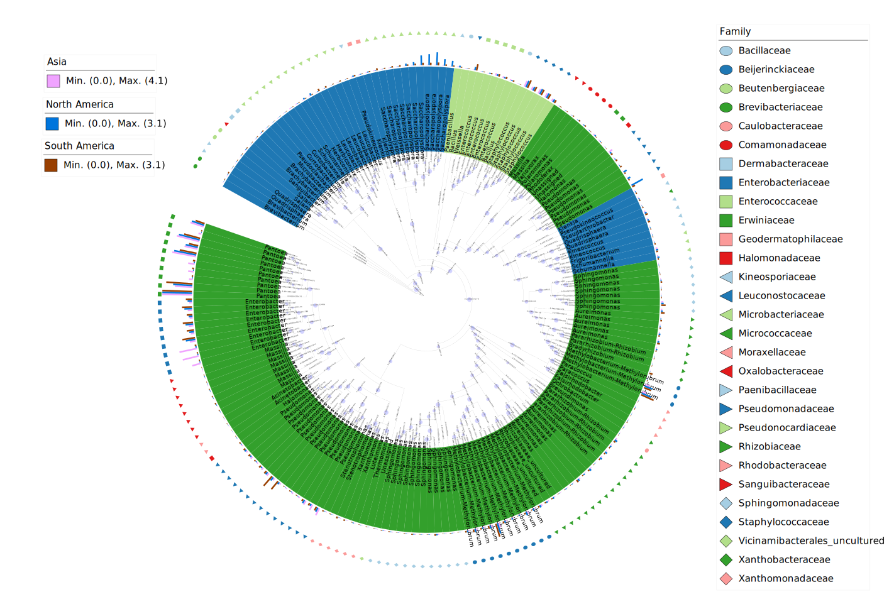
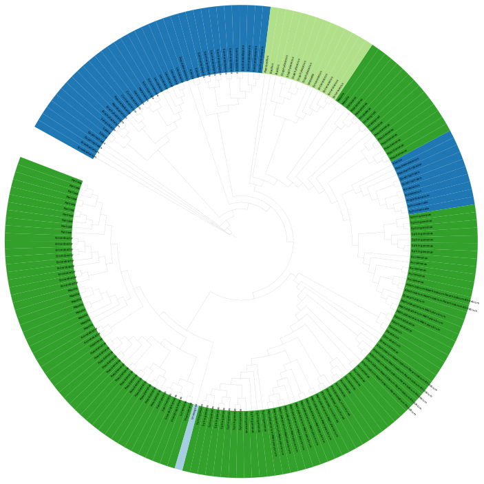
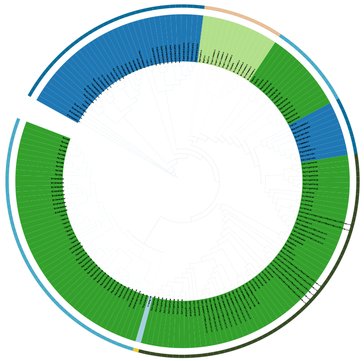
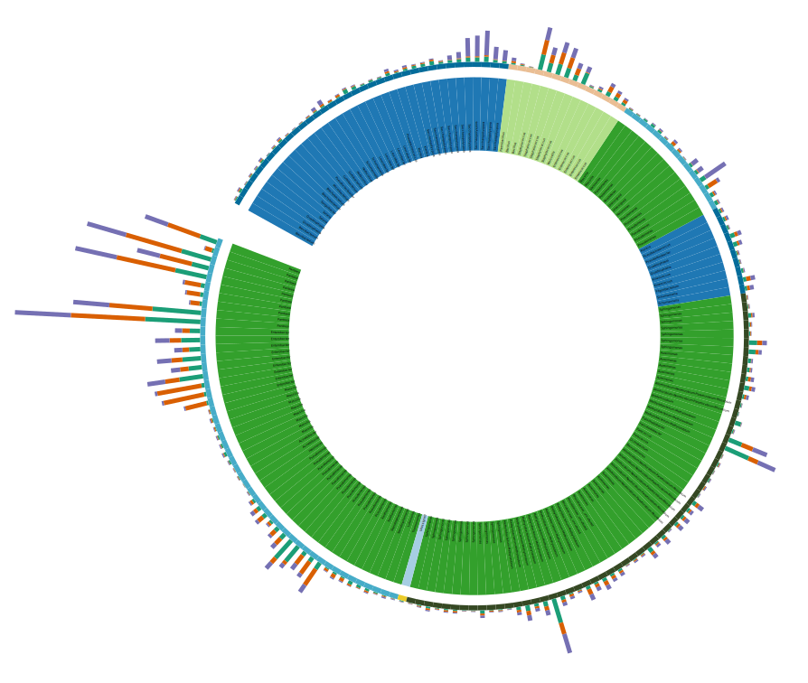
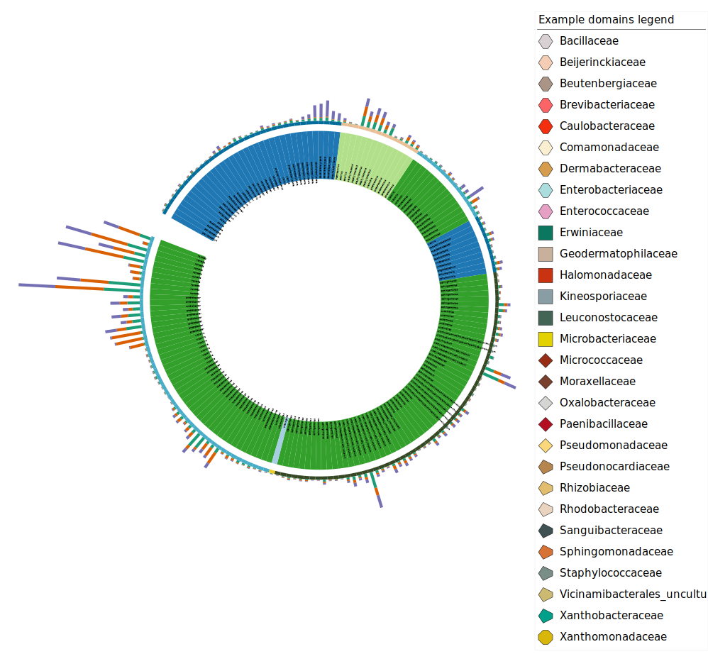
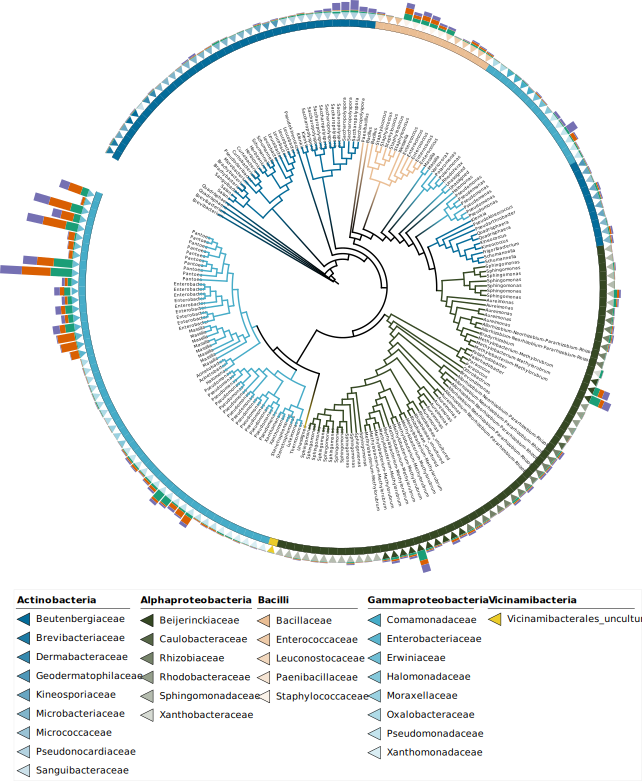

```{r, include = FALSE}
knitr::opts_chunk$set(
  collapse = TRUE,
  eval = FALSE,
  echo = TRUE,
  message=FALSE,
  warning=FALSE,
  comment = "#>"
)
```

## table2itol

```{bash}
[TOC]
#!/bin/bash
###Zhou xin

## Beautifying evolutionary tree

## Scheme 1. Outer ring color, shape classification and abundance scheme
# annotation.txt OTU correspond to species annotations and abundance，
# -a Cannot find the input column will terminate the run (not executed by default)
#-c Converts an integer column to a factor or a number with a decimal point
#-t Transforms the ID column when deviating from the hint label
#-w Color band, area width, etc
#-D Output directory
#-i OTU column name
#-l OTU display names such as species/genus/family names
# cd ${wd}/result/tree
Rscript ./table2itol.R -a -c double -D plan1 -i OTUID -l Genus -t %s -w 0.5 annotation.txt
# Generate a separate file for each column in the comment file

## Scheme 2. Generate annotation file of abundance column bar chart
Rscript ./table2itol.R -a -d -c none -D plan2 -b Phylum -i OTUID -l Genus -t %s -w 0.5 annotation.txt

## Scheme 3. Generate annotation file of heat map
Rscript ./table2itol.R -c keep -D plan3 -i OTUID -t %s otutab_high.mean

## Scheme 4. Convert integers into factors to generate comment files
Rscript ./table2itol.R -a -c factor -D plan4 -i OTUID -l Genus -t %s -w 0 annotation.txt

# Return to the working directory
cd ${wd}
```



## itol.toolkit

```{r}
library(itol.toolkit) # main package
library(dplyr) # data manipulation
library(data.table) # file read
library(ape) # tree operation
library(stringr) # string operation
library(tidyr) # data manipulation
```

```{r}
tree_1 <- system.file("extdata","dataset4/otus.contree",package = "itol.toolkit")
hub_1 <- create_hub(tree_1)
data_file_1 <- system.file("extdata","dataset4/annotation.txt",package = "itol.toolkit")
data_file_2 <- system.file("extdata","dataset4/otutab_high.mean",package = "itol.toolkit")
data_1 <- data.table::fread(data_file_1)
data_2 <- data.table::fread(data_file_2)
```


```{r}
# relabel by genus
unit_1 <- create_unit(data = data_1 %>% select(ID, Genus),
                      key = "rep_Zhou_1_labels",
                      type = "LABELS",
                      tree = tree_1)
write_unit(unit_1)
```


```{r}
# tree_colors range by phylum
unit_2 <- create_unit(data = data_1 %>% select(ID, Phylum),
                    key = "rep_Zhou_2_range",
                    type = "TREE_COLORS",
                    subtype = "range",
                    tree = tree_1)
write_unit(unit_2)
```



```{r}
# color_strip by class
set.seed(123)
unit_3 <- create_unit(data = data_1 %>% select(ID, Class),
                      key = "rep_Zhou_3_strip",
                      type = "DATASET_COLORSTRIP",
                      color = "wesanderson",
                      tree = tree_1)
unit_3@common_themes$basic_theme$margin <- 50
```



```{r}
# simple_bar by NS
unit_4 <- create_unit(data = data_1 %>% select(ID, South_America, Asia, North_America),
                      key = "rep_Zhou_4_multibar",
                      type = "DATASET_MULTIBAR",
                      tree = tree_1)
unit_4@specific_themes$basic_plot$size_max <- 100
```



```{r}
#Adding comment tag
unit_5 <- create_unit(data = data_1 %>% select(ID, Class, Family),
                      key = "rep_Zhou_5_binary",
                      type = "DATASET_DOMAINS",
                      color = "wesanderson",
                      tree = tree_1)
```



### write by hub level
```{r}
#Storing drawing information
hub_1 <- hub_1 +
  unit_1 +
  unit_2 +
  unit_3 +
  unit_4 +
  unit_5

write_hub(hub_1,getwd())
```

## New in v1.1.8
Pencil Plot
```{r}
set.seed(123)
unit_6 <- create_unit(data = data_1 %>% select(ID, Class, Family),
                      key = "New_in_v1.1.8",
                      type = "DATASET_DOMAINS",
                      color = "wesanderson",
                      shape = "TL",
                      tree = tree_1)
write_unit(unit_6)
```


## Comparison between itol.toolkit and table2itol

| Function                            | itol.toolkit            | table2itol                                         |
|------------------------|------------------------|------------------------|
| Support template types              | 23                      | 11                                                 |
| Usage                               | interactive R or script | command                                            |
| Maxiuim color platter               | 76                      | 40                                                 |
| Theme adjustable                    | TRUE                    | FALSE                                              |
| Share format                        | All-in-one hub object   | separated code and data                            |
| Can extact data from template files | TRUE                    | FALSE                                              |
| Output files                        | Flexibel                | Output non-related files (Non-modifiable workflow) |
