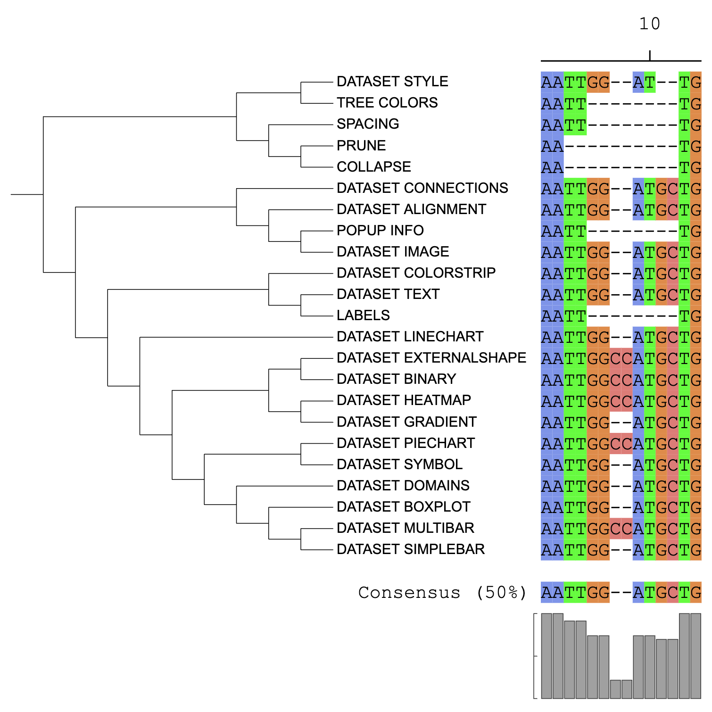

```{r, include = FALSE}
knitr::opts_chunk$set(
  collapse = TRUE,
  eval = FALSE,
  echo = TRUE,
  message=FALSE,
  warning=FALSE,
  comment = "#>"
)
```

## Introduction
The function of the `DATASET_ALIGNMENT` is to display multiple sequence alignments (MSA) next to the leaf node. Consensus sequence (at 50% conservation) and conserved residues will be calculated automatically. The `DATASET_ALIGNMENT` template belongs to the "Advanced Graphics" class (refer to the [Class]() for detail information).

## visualize multiple sequence alignments
This section provides an example of how to visualize multiple sequence alignments using [dataset 1](https://github.com/TongZhou2017/itol.toolkit/tree/master/inst/extdata/dataset1) (refer to the [Dataset](https://tongzhou2017.github.io/itol.toolkit/articles/Datasets.html) for detail information) document for detailed information).

The first step is to load the `newick` format tree file `tree_of_itol_templates.tree` and its corresponding metadata `parameter_groups.txt`. The `parameter_groups.txt` file contains the type of each parameter and the parameters contained in each template.
```{r load data}
library(itol.toolkit)
library(data.table)
library(dplyr)
library(tidyr)
tree <- system.file("extdata",
                    "tree_of_itol_templates.tree",
                    package = "itol.toolkit")
parameter_groups <- system.file("extdata",
                                "parameter_groups.txt",
                                package = "itol.toolkit")
```
In practice, the user needs to prepare the input file as the following format: the first column should be the tips of the tree, and the second column should be the sequence after multiple sequence aligning. The leaf node name in `tree_of_itol_templates.tree` is template names. Here, we generate a sequence for each tip based on the types of it corresponding template parameters. These sequences are used to simulate the MSA result. 
```{r data process}
tab_tmp <- fread(parameter_groups)
tab_id_group <- tab_tmp[, c(1,2)]
tab_tmp <- tab_tmp[, -c(1,2)]
tab_tmp_01 <- convert_01(object = tab_tmp)
tab_tmp_01 <- cbind(tab_id_group, tab_tmp_01)
order <- c("type",
           "separator",
           "profile",
           "field",
           "common themes",
           "specific themes",
           "data")
tab_tmp_01_long <- tab_tmp_01 %>%
                   melt(id.vars=c("parameter","group"))
template_start_group <- tab_tmp_01_long %>%
                        group_by(group,variable) %>%
                        summarise(sublen = sum(value)) %>%
                        tidyr::spread(key=variable,value=sublen)
template_start_group$group <- factor(template_start_group$group,levels = order)
template_start_group <- template_start_group %>%
                        arrange(group)
start_group <- data.frame(Var1 = template_start_group$group, Freq = apply(template_start_group[,-1], 1, max))
start_group$start <- 0
for (i in 2:nrow(start_group)) {
    start_group$start[i] <- sum(start_group$Freq[1:(i-1)])
}
# Just simulate MSA as example, not necessary for real run
template_start_group <- as.data.frame(t(template_start_group))
colnames(template_start_group) <- template_start_group[1,]
template_start_group <- template_start_group[-1,]
template_start_group[template_start_group == 0] <- "--"
template_start_group[template_start_group == " 0"] <- "--"
template_start_group$type[template_start_group$type != "--"] <- "AA"
template_start_group$separator[template_start_group$separator != "--"] <- "TT"
template_start_group$profile[template_start_group$profile != "--"] <- "GG"
template_start_group$field[template_start_group$field != "--"] <- "CC"
template_start_group$`common themes`[template_start_group$`common themes` != "--"] <- "AT"
template_start_group$`specific themes`[template_start_group$`specific themes` != "--"] <- "GC"
template_start_group$data[template_start_group$data != "--"] <- "TG"
template_start_group <- template_start_group %>%
                        mutate(id = rownames(template_start_group)) %>%
                        tidyr::unite("seq",type:data,remove = T, sep = "") %>%
                        select(id,seq)
```
The processed data is stored in the variable `template_start_group`, with the first column being the template name and the second column being the sequence.
```{r visualize multiple sequence alignments}
unit_42 <- create_unit(data = template_start_group,
                       key = "E042_alignment_1",
                       type = "DATASET_ALIGNMENT",
                       tree = tree)
```



## Style modification

### Consensus sequence
The threshold for consensus calculation can be set by the `unit@specific_themes$alignment$consensus$threshold` variable (0 ~ 100). To ignore any gaps in the alignment when calculating the consensus, set `unit@specific_themes$alignment$gap$ignore` to 1. 

### Residues and reference sequences
Residues in the alignment can be highlighted as dots by setting the `unit@specific_themes$alignment$highlight$type`. When set to consensus, each residue will be displayed as a dot if it does not match the consensus sequence. When `unit@specific_themes$alignment$highlight$type` is set to reference, residues will be compared to the reference sequences defined in `unit@specific_themes$alignment$reference$ids`. When `unit@specific_themes$alignment$reference$ids` defined, reference sequences can be marked with boxes by setting `unit@specific_themes$alignment$reference$use` to 1.
