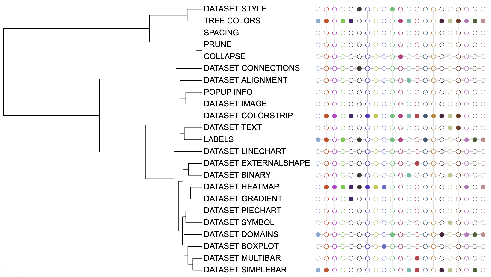
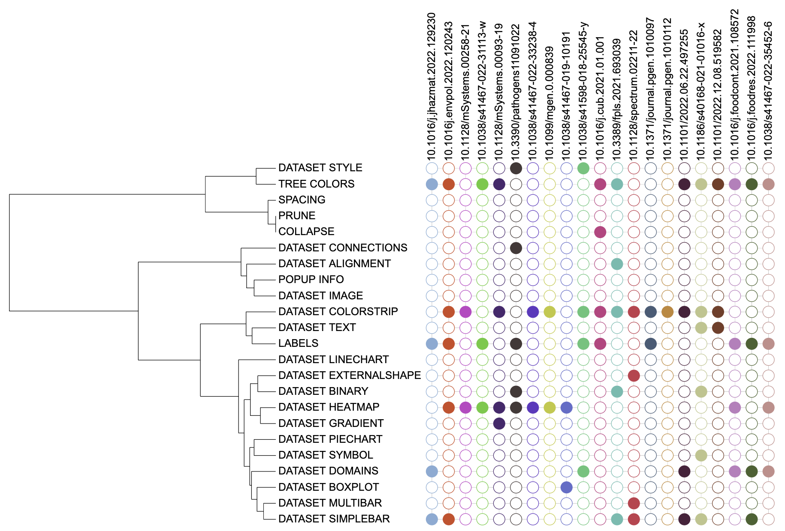

```{r, include = FALSE}
knitr::opts_chunk$set(
  collapse = TRUE,
  eval = FALSE,
  echo = TRUE,
  message=FALSE,
  warning=FALSE,
  comment = "#>"
)
```

## Introduction
The function of `DATASET_BINARY` template is to visualize binary datasets as outlined or filled symbols.  The `DATASET_BINARY` template belongs to the "Basic graphics" class (refer to the [Class]() for detail information).

Typically, users visualize binary datasets as outlined or filled symbols by entering branch/node names and metadata, where 1 corresponds to a filled shape, 0 corresponds to a outlined shape, and - 1 corresponds to a completely omitted shape.

This section shows how to use `DATASET_BINARY` template to visualize binary datasets. Without `itol.toolkit`, users need to manually set subtype parameters and enter data. The `itol.toolkit` makes the entire workflow coherent, allowing users to process data in R environment and directly output the template.

## Draw symbols
This section uses [dataset 1](https://github.com/TongZhou2017/itol.toolkit/tree/master/inst/extdata/dataset1) as an example to show the visualization of binary data in different types of trees (refer to the [Dataset](https://tongzhou2017.github.io/itol.toolkit/articles/Datasets.html).

The first step is to load the `newick` format tree file `tree_of_itol_templates.tree` and its corresponding metadata `template_frequence`.
```{r load data}
library(itol.toolkit)
library(data.table)
library(ape)
tree <- system.file("extdata",
                    "tree_of_itol_templates.tree",
                    package = "itol.toolkit")
df_frequence <- system.file("extdata",
                    "templates_frequence.txt",
                    package = "itol.toolkit")

```
The metadata is processed to convert the usage frequency to binary data. We use 1 to indicate that the template type is used in the article, and 0 to indicate that the template type is not used in the article.
```{r metadata process}
df_frequence <- fread(df_frequence)
# assign 0 to missing values (unused template types)
df_frequence[is.na(df_frequence)] <- 0
# save the template type column in a variable to prevent overwriting in subsequent assignments
ids <- df_frequence$templates
# assign 1 to values > 0 (used template types)
df_frequence[df_frequence>0] <- 1
# rewrite the overwritten template type column
df_frequence$templates <- ids
# replace spaces in column names with "_" to prevent errors
names(df_frequence) <- stringr::str_replace_all(names(df_frequence)," ","_")
```
We can use the `DATASET_BINARY` template to visualize binary dataset as outlined or filled circles.We can adjust the size of the symbols through `unit@specific_themes$basic_plot$height_factor`.
```{r binary for circular symbol height factor}
unit_24 <- create_unit(data = df_frequence,
                       key = "E024_binary_1",
                       type = "DATASET_BINARY",
                       tree = tree)
unit_24@specific_themes$basic_plot$height_factor <- 0.4
```



It is worth noting that the same symbol size will be displayed differently in different tree shapes. Therefore, here we create symbols suitable for a rectangular tree by adjusting `unit@specific_themes$basic_plot$height_factor` to 0.8. We can add labels to the symbols through `unit@common_themes$label$display`.
```{r binary for rectangular symbol height factor}
unit_25 <- create_unit(data = df_frequence,
                       key = "E025_binary_2",
                       type = "DATASET_BINARY",
                       tree = tree)
unit_25@specific_themes$basic_plot$height_factor <- 0.8
unit_25@common_themes$label$display <- 1
```



## Style modification
You can adjust the symbol size to fit your tree by adjusting `unit@specific_themes$basic_plot$height_factor`.
