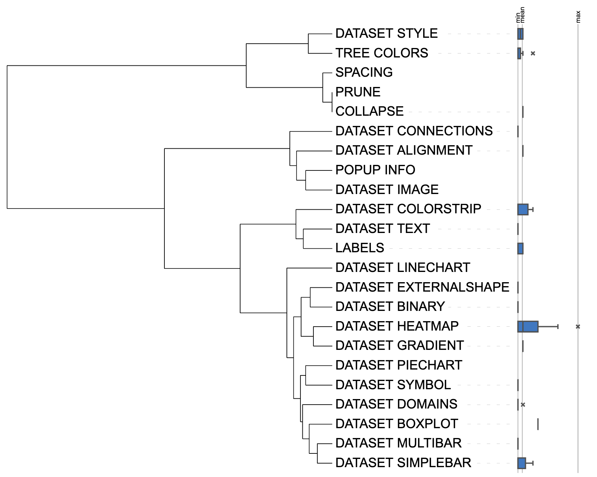
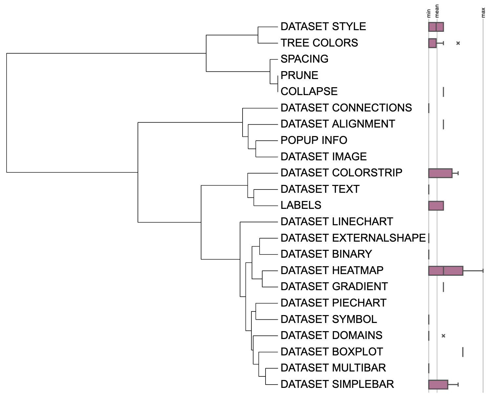

```{r, include = FALSE}
knitr::opts_chunk$set(
  collapse = TRUE,
  eval = FALSE,
  echo = TRUE,
  message=FALSE,
  warning=FALSE,
  comment = "#>"
)
```

##Introduction
The function of `DATASET_BOXPLOT` template is to visualize multi-column wide data as a box plot displayed outside the tree. The box plot shows the distribution of each data set corresponding to the tip, including the maximum, minimum, quartiles and extreme values. The `DATASET_BOXPLOT` template belongs to the "Basic graphics" class (refer to the [Class]() for detail information).

This section shows how to use the itol.toolkit to prepare a box plot template. Without itol.toolkit, users would have to calculate and list the maximum, minimum, quartiles and extreme values for each set of data manually. When there are multiple extreme values in the data, the number of columns for each records in input data becomes unequal,resulting in significant inconvenience for the user in preparing the template file. The itol.toolkit could automatically generate the data format required for the template from input data, greatly improving the efficiency of drawing box plots and reducing the difficulty of data preparation.

## Draw box plot
This section uses [dataset 1](https://github.com/TongZhou2017/itol.toolkit/tree/master/inst/extdata/dataset1) to draw a box plot (refer to the  [Dataset](https://tongzhou2017.github.io/itol.toolkit/articles/Datasets.html) for detail information).

The first step is to load the `newick` format tree file `tree_of_itol_templates.tree` and its corresponding metadata `templates_frequence`. Briefly, the `templates_frequence` contains the usage of each template type in 21 published studies.

```{r load data}
library(itol.toolkit)
library(data.table)
library(ape)
library(dplyr)
tree <- system.file("extdata",
                    "tree_of_itol_templates.tree",
                    package = "itol.toolkit")
df_frequence <- system.file("extdata",
                            "templates_frequence.txt",
                             package = "itol.toolkit")
df_frequence <- fread(df_frequence)
```
We perform a simple process on the input raw data to convert the wide data to a long data. The first column of the converted table shows the templates used in each study, and the second column shows the frequency of each template used in each article. Next, we use this as input data to generate a box plot template.
```{r box plot}
df_data <- df_frequence %>% 
  melt(id.vars=c("templates")) %>% 
  na.omit() %>% 
  select(templates,value)
unit_38 <- create_unit(data = df_data,
                       key = "E038_boxplot_1",
                       type = "DATASET_BOXPLOT",
                       tree = tree)
```



We can also convert the original data, such as log conversion, and then use it to draw a box plot.
```{r box plot log}
df_data$value <- log(df_data$value)
unit_39 <- create_unit(data = df_data,
                       key = "E039_boxplot_2",
                       type = "DATASET_BOXPLOT",
                       tree = tree)
```



## Style modification
You can adjust the height of the box plot by adjusting `unit@specific_themes$basic_plot$width`.
