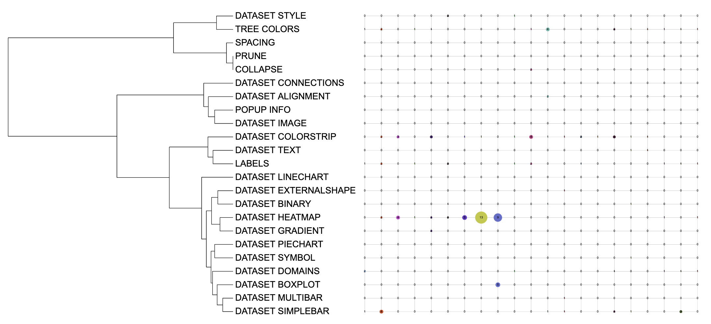

```{r, include = FALSE}
knitr::opts_chunk$set(
  collapse = TRUE,
  eval = FALSE,
  echo = TRUE,
  message=FALSE,
  warning=FALSE,
  comment = "#>"
)
```

## Introduction
The function of template `DATASET_EXTERNALSHAPE` is to add shape plots outside nodes. Each leaf node could have multiple items in its shape plots and the size of each item represents its associated numeric values. Highest value in the dataset have the largest size, and others are scaled down proportionally. The `DATASET_EXTERNALSHAPE` template belongs to the "Basic graphics" class (refer to the [Class]() for detail information).

Typically, users draw a shape plot by entering node names, either leaf node or internal node, and their corresponding data values. Without itol.toolkit, users would have to prepare data and visualize it separately. In contrast, itol.toolkit provides a coherent workflow, allowing users to prepare data and output template file seamlessly.

## Draw shape plot
This section provides an example of a shape plot through multi-column data using [dataset 1](https://github.com/TongZhou2017/itol.toolkit/tree/master/inst/extdata/dataset1) (refer to the [Dataset](https://tongzhou2017.github.io/itol.toolkit/articles/Datasets.html) for detail information) document for detailed information).

The first step is to load the `newick` format tree file `tree_of_itol_templates.tree` and its corresponding metadata `templates_frequence.txt`.
```{r load data}
library(itol.toolkit)
library(data.table)
tree <- system.file("extdata",
                    "tree_of_itol_templates.tree",
                    package = "itol.toolkit")
df_frequence <- system.file("extdata",
                            "templates_frequence.txt",
                             package = "itol.toolkit")
df_frequence <- fread(df_frequence)
```
Next, we process the metadata by replacing the missing values (representing that the template was not used in this study) with 0. By processing the data, we ended up with a data frame with the first column being the tip name and the subsequent columns being the usage frequency of the template in the study. Finally, we take the obtained data as input and visualize it using the `DATASET_EXTERNALSHAPE` template.
```{r external shape}
df_frequence[is.na(df_frequence)] <- 0
unit_33 <- create_unit(data = df_frequence,
                      key = "E033_external_shape_1",
                      type = "DATASET_EXTERNALSHAPE",
                      tree = tree)
```



It is worth noting that when using `DATASET_EXTERNALSHAPE` template in `itol.toolkit` < v1.1.1, you may encounter the problem *Error in get_color(field_length, set = color) : object 'field_length' not found*, please update `itol.toolkit` in this case.

## Style modification
The user can adjust the shape with `unit@specific_themes$externalshape$type` and the shape code is shown below:  
|id|shape|
|---|---|
|1|square|
|2|circle|
|3|star|
|4|right triangle|
|5|left triangle |
For example, we can adjust the shape of `unit_27` to the circle by:
```{r change shape}
unit_33@specific_themes$externalshape$type <- 2
```
