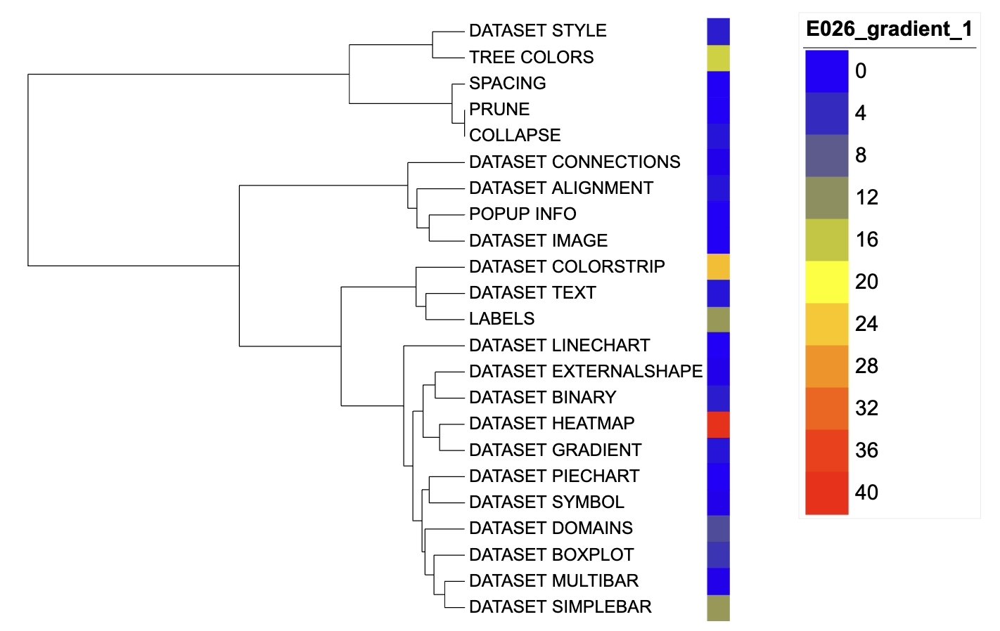
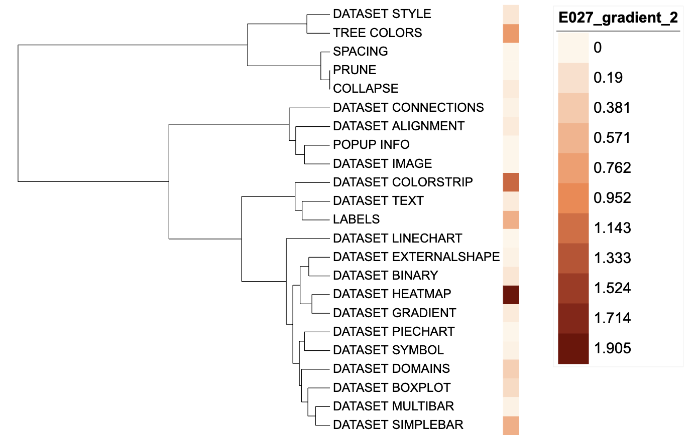

```{r, include = FALSE}
knitr::opts_chunk$set(
  collapse = TRUE,
  eval = FALSE,
  echo = TRUE,
  message=FALSE,
  warning=FALSE,
  comment = "#>"
)
```

## Introduction
The function of `DATASET_GRADIENT` is to associate specified tree nodes to numeric values, which is displayed as a colored rectangle outside the tree. The `DATASET_GRADIENT` template belongs to the "Basic graphics" class (refer to the [Class]() for detail information).

Typically, users would have to enter the leaf node name and the corresponding value in pairs to generate a colored rectangle outside the corresponding tip node. However, the raw data users need to process are usually to be the multi-column wide data (e.g. data from multiple biological replicates), which need users to calculate a statistic (e.g. average value). Thus, the data analysis and iTOL visualization preparation are separated without itol.toolkit.

This section shows how to use itol.toolkit to add corresponding numerical values to tip nodes. Users can directly enter multi-column data into `itol.toolkit`. The program will automatically calculate statistics from input data using a batch of methods, making the workflow of data analysis and visualization coherent. In general, Users can determine data processing methods based on their needs and output templates directly.

## Visualize numerical information
This section uses [dataset 1](https://github.com/TongZhou2017/itol.toolkit/tree/master/inst/extdata/dataset1) as an example to show the visualization of binary data in different types of trees (refer to the [Dataset](https://tongzhou2017.github.io/itol.toolkit/articles/Datasets.html).

The first step is to load the `newick` format tree file `tree_of_itol_templates.tree` and its corresponding metadata `template_frequence`. Briefly, the `templates_frequence` contains the usage of each template type in 21 published studies.
```{r load data}
library(itol.toolkit)
library(data.table)
library(ape)
tree <- system.file("extdata",
                    "tree_of_itol_templates.tree",
                    package = "itol.toolkit")
df_frequence <- system.file("extdata",
                            "templates_frequence.txt",
                             package = "itol.toolkit")
df_frequence <- fread(df_frequence)
```
Suppose users want to sum the frequency of each template used in 21 articles, and visualizing it using gradient color, users could use following codes. Notably, if users enter multiple columns of data and does not specify a method, itol.toolkit uses the `sum` method to process the data by default.
```{r gradient auto sum}
unit_26 <- create_unit(data = df_frequence,
                       key = "E026_gradient_1",
                       type = "DATASET_GRADIENT",
                       tree = tree)
```



We can also calculate the average usage frequency of each template in published articles by specifying the `method` parameter as `mean`, and use it in gradient coloring.
```{r gradient mean}
unit_27 <- create_unit(data = df_frequence,
                       key = "E027_gradient_2",
                       type = "DATASET_GRADIENT",
                       method = "mean",
                       tree = tree)
```


## Style modification
By adjusting `unit@specific_themes$heatmap$color$min`, `unit@specific_themes$heatmap$color$mid`, and `unit@specific_themes$heatmap$color$max`, users can customize the color gradient of the rectangle. Here, we set different colors for `unit_23` and `unit_24`.
```{r set color}
unit_26@specific_themes$heatmap$color$min <- "#0000ff"
unit_26@specific_themes$heatmap$color$max <- "#ff0000"

unit_27@specific_themes$heatmap$color$min <- "#FFF7ED"
unit_27@specific_themes$heatmap$color$mid <- "#FC8E58"
unit_27@specific_themes$heatmap$color$max <- "#800000"
```
