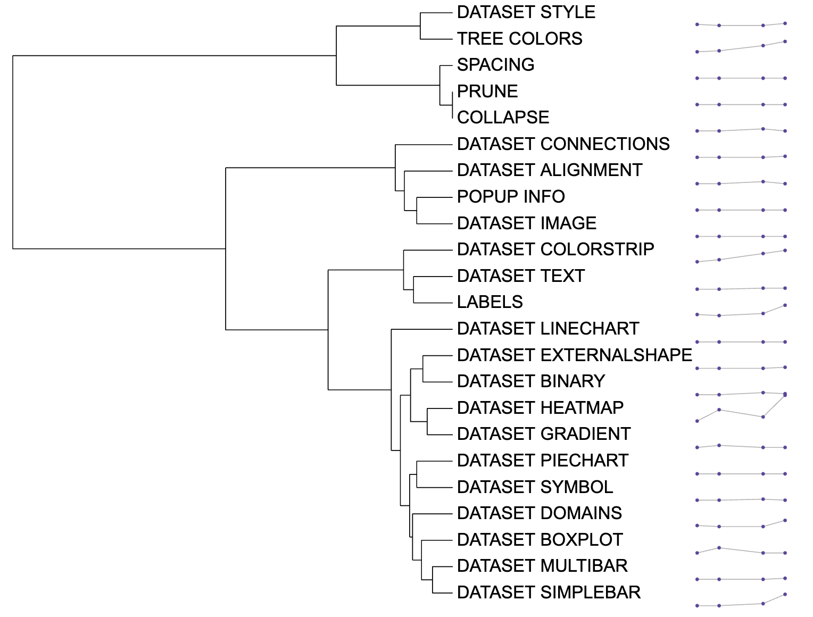

```{r, include = FALSE}
knitr::opts_chunk$set(
  collapse = TRUE,
  eval = FALSE,
  echo = TRUE,
  message=FALSE,
  warning=FALSE,
  comment = "#>"
)
```

## Introduction
The function of `DATASET_LINECHART` could draw the line chart and store corresponding X-axis coordinates and Y-axis coordinates. The `DATASET_LINECHART` template belongs to the "Basic graphics" class (refer to the [Class]() for detail information).

Typically, users cannot save drawing information using iTOL, making it difficult to reproduce pictures or share them with others.

Here, itol.toolkit provides a convenient way to store **X-axis** and **Y-axis** coordinates for line charts.  This section shows how to use itol.toolkit to draw the line chart and store corresponding information.

## Draw line chart
This section uses [dataset 1](https://github.com/TongZhou2017/itol.toolkit/tree/master/inst/extdata/dataset1) as an example to show how to draw the line chart. (refer to the  [Dataset](https://tongzhou2017.github.io/itol.toolkit/articles/Datasets.html) for detail information)

### Load data
The first step is to load the `newick` format tree file `tree_of_itol_templates.tree` and its corresponding metadata `df_frequence`. 
```{r load data}
library(itol.toolkit)
library(data.table)
library(tidyr)
library(dplyr)
library(stringr)
library(ape)
tree <- system.file("extdata",
                    "tree_of_itol_templates.tree",
                    package = "itol.toolkit")
df_frequence <- system.file("extdata",
                            "templates_frequence.txt",
                             package = "itol.toolkit")
df_frequence <- fread(df_frequence)
names(df_frequence) <- c(
  "id",
  "Li,S. et al. (2022) J. Hazard. Mater.","Zheng,L. et al. (2022) Environ. Pollut.",
  "Welter,D.K. et al. (2021) mSystems",
  "Zhang,L et al. (2022) Nat. Commun.",
  "Rubbens,P. et al. (2019) mSystems",
  "Laidoudi,Y. et al. (2022) Pathogens",
  "Wang,Y. et al. (2022) Nat. Commun.",
  "Ceres,K.M. et al. (2022) Microb. Genomics",
  "Youngblut,N.D. et al. (2019) Nat. Commun.",
  "Balvín,O. et al. (2018) Sci. Rep.",
  "Prostak,S.M. et al. (2021) Curr. Biol.",
  "Dijkhuizen,L.W. et al. (2021) Front. Plant Sci.",
  "Zhang,X. et al. (2022) Microbiol. Spectr.",
  "Peris,D. et al. (2022) PLOS Genet.",
  "Denamur,E. et al. (2022) PLOS Genet.",
  "Dezordi,F.Z. et al. (2022) bioRxiv",
  "Lin,Y. et al. (2021) Microbiome",
  "Wang,Y. et al. (2022) bioRxiv",
  "Qi,Z. et al. (2022) Food Control",
  "Zhou,X. et al. (2022) Food Res. Int.",
  "Zhou,X. et al. (2022) Nat. Commun.")
names(df_frequence) <- stringr::str_remove_all(names(df_frequence),"[()]")
names(df_frequence) <- stringr::str_replace_all(names(df_frequence),",","-")
```
## Data processing and create the unit
Convert wide data to long data. After conversion, the input data fed to `DATASET_LINECHART` 
should have three columns: tree tip id, X-axis coordinates, and Y-axis coordinates.
```{r}
df_frequence_years <- df_frequence %>% 
  pivot_longer(-id) %>% 
  mutate(years = str_extract(name,"\\d{4}")) %>% 
  replace(is.na(.), 0) %>% 
  group_by(id,years) %>% 
  summarise(value = sum(value)) %>% 
  pivot_wider(names_from=years,values_from=value) %>% 
  replace(is.na(.), 0) %>% 
  pivot_longer(-id)
unit_40 <- create_unit(data = df_frequence_years,
                    key = "E040_linechart_1",
                    type = "DATASET_LINECHART",
                    tree = tree)
```


