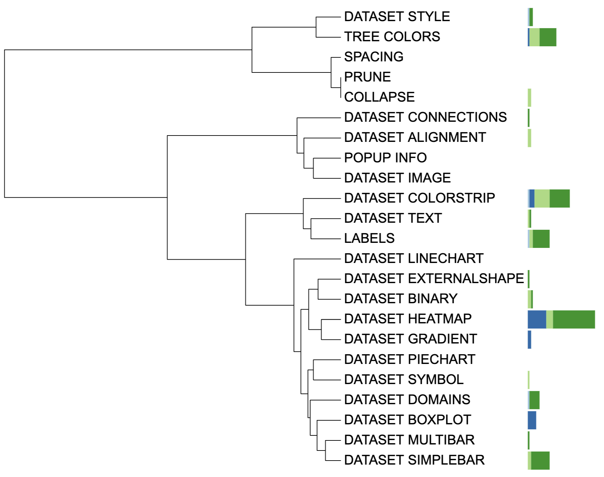

```{r, include = FALSE}
knitr::opts_chunk$set(
  collapse = TRUE,
  eval = FALSE,
  echo = TRUE,
  message=FALSE,
  warning=FALSE,
  comment = "#>"
)
```

## Introduction
The function of `DATASET_MULTIBAR` is to prepare templates for drawing multi-value bar charts. In multibar charts, each tip node is associated to multiple numeric values, which are displayed as a stacked or aligned bar chart outside the tree. The `DATASET_MULTIBAR` template belongs to the "Basic graphics" class (refer to the [Class]() for detail information).

In multibar charts, individual fields (values) require corresponding labels and colors that are defined using "FIELD_LABELS" and "FIELD_COLOR" lines in the template. Additionally, these values are typically statistics derived from raw data, such as the average and sum. Unfortunately, iTOL does not support statistical analysis, making it necessary for users to use other tools to perform such analysis. Additionally, the raw data was excluded in iTOL templates, posing difficulties in reproducing figures or sharing them with others.

Here, we provide a convenient way to calculate **statistics** for multibar charts and store `FIELD_LABELS` and `FIELD_COLOR` values. This section describes how to use `itol.toolkit` to prepare the multi-value bar charts templates.

## Plot multibar plot
This section uses [dataset 1](https://github.com/TongZhou2017/itol.toolkit/tree/master/inst/extdata/dataset1) as an example to show how to draw the multibar charts. (refer to the  [Dataset](https://tongzhou2017.github.io/itol.toolkit/articles/Datasets.html) for detail information)

### Load data
The first step is to load the `newick` format tree file `tree_of_itol_templates.tree` and its corresponding metadata `df_frequence`. 
```{r load data}
library(itol.toolkit)
library(data.table)
library(tidyr)
library(dplyr)
library(stringr)
library(ape)
tree <- system.file("extdata",
                    "tree_of_itol_templates.tree",
                    package = "itol.toolkit")
df_frequence <- system.file("extdata",
                            "templates_frequence.txt",
                             package = "itol.toolkit")
df_frequence <- data.table::fread(df_frequence)
names(df_frequence) <- c(
  "id",
  "Li,S. et al. (2022) J. Hazard. Mater.","Zheng,L. et al. (2022) Environ. Pollut.",
  "Welter,D.K. et al. (2021) mSystems",
  "Zhang,L et al. (2022) Nat. Commun.",
  "Rubbens,P. et al. (2019) mSystems",
  "Laidoudi,Y. et al. (2022) Pathogens",
  "Wang,Y. et al. (2022) Nat. Commun.",
  "Ceres,K.M. et al. (2022) Microb. Genomics",
  "Youngblut,N.D. et al. (2019) Nat. Commun.",
  "Balvín,O. et al. (2018) Sci. Rep.",
  "Prostak,S.M. et al. (2021) Curr. Biol.",
  "Dijkhuizen,L.W. et al. (2021) Front. Plant Sci.",
  "Zhang,X. et al. (2022) Microbiol. Spectr.",
  "Peris,D. et al. (2022) PLOS Genet.",
  "Denamur,E. et al. (2022) PLOS Genet.",
  "Dezordi,F.Z. et al. (2022) bioRxiv",
  "Lin,Y. et al. (2021) Microbiome",
  "Wang,Y. et al. (2022) bioRxiv",
  "Qi,Z. et al. (2022) Food Control",
  "Zhou,X. et al. (2022) Food Res. Int.",
  "Zhou,X. et al. (2022) Nat. Commun.")
names(df_frequence) <- stringr::str_remove_all(names(df_frequence),"[()]")
names(df_frequence) <- stringr::str_replace_all(names(df_frequence),",","-")
```
### Data processing and create the unit
Convert wide data to long data. After conversion, the input data fed to `DATASET_MULTIBAR` 
should have at least two columns: The first column is tip id and the other should contain the values to plot. The `itol.toolkit` will automatically assigned FIELD_LABELS` by columns names ` and `FIELD_COLORS` by the palette.
```{r}
df_frequence_years <- df_frequence %>%
   pivot_longer(-id)%>%
   na.omit() %>%
   mutate(years = str_extract(name,"\\d{4}")) %>%
   group_by(id,years) %>%
   summarise(value = sum(value)) %>%
   spread(years,value) %>%
   replace(is.na(.), 0)
unit_37 <- create_unit(data = df_frequence_years,
                    key = "E037_simplebar_2", 
                    type = "DATASET_MULTIBAR", 
                    tree = tree)
write_unit(unit_37)
```


