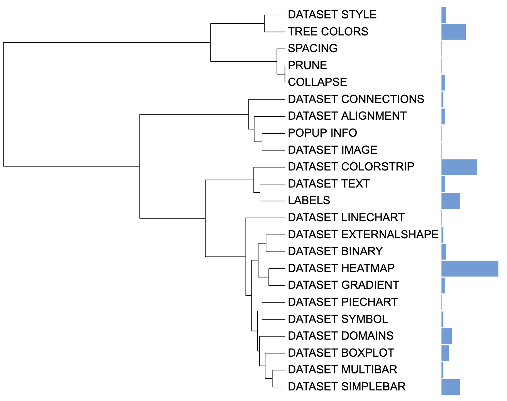

```{r, include = FALSE}
knitr::opts_chunk$set(
  collapse = TRUE,
  eval = FALSE,
  echo = TRUE,
  message=FALSE,
  warning=FALSE,
  comment = "#>"
)
```

## Introduction
The `DATASET_SIMPLEBAR` template is to draw the simple bar charts and store corresponding numeric value. The `DATASET_SIMPLEBAR` template belongs to the "Basic graphics" class (refer to the [Class]() for detail information).

In simple bar chart, each tree node is associated to a single numeric value, which is displayed as a bar outside the tree. This value is typically statistics derived from raw data, such as the average and sum. Unfortunately, iTOL does not support statistical analysis, making it necessary for users to use other tools to perform such analysis. Additionally, the raw data was excluded in iTOL templates, posing difficulties in reproducing pictures or sharing them with others.

Here, `itol.toolkit` provide a convenient way to calculate  **statistics** of simple bar charts. This section describes how to use `itol.toolkit` to prepare the simple bar chart templates.

This section uses [dataset 1](https://github.com/TongZhou2017/itol.toolkit/tree/master/inst/extdata/dataset1) as an example to show how to draw the Simple bar charts. (refer to the  [Dataset](https://tongzhou2017.github.io/itol.toolkit/articles/Datasets.html) for detail information)

## Load data
The first step is to load the `newick` format tree file `tree_of_itol_templates.tree` and its corresponding metadata `df_frequence`. 
```{r load data}
library(itol.toolkit)
library(data.table)
library(tidyr)
library(dplyr)
library(stringr)
library(ape)
tree <- system.file("extdata",
                    "tree_of_itol_templates.tree",
                    package = "itol.toolkit")
df_frequence <- system.file("extdata",
                            "templates_frequence.txt",
                             package = "itol.toolkit")
df_frequence <- fread(df_frequence)
names(df_frequence) <- c(
  "id",
  "Li,S. et al. (2022) J. Hazard. Mater.","Zheng,L. et al. (2022) Environ. Pollut.",
  "Welter,D.K. et al. (2021) mSystems",
  "Zhang,L et al. (2022) Nat. Commun.",
  "Rubbens,P. et al. (2019) mSystems",
  "Laidoudi,Y. et al. (2022) Pathogens",
  "Wang,Y. et al. (2022) Nat. Commun.",
  "Ceres,K.M. et al. (2022) Microb. Genomics",
  "Youngblut,N.D. et al. (2019) Nat. Commun.",
  "Balvín,O. et al. (2018) Sci. Rep.",
  "Prostak,S.M. et al. (2021) Curr. Biol.",
  "Dijkhuizen,L.W. et al. (2021) Front. Plant Sci.",
  "Zhang,X. et al. (2022) Microbiol. Spectr.",
  "Peris,D. et al. (2022) PLOS Genet.",
  "Denamur,E. et al. (2022) PLOS Genet.",
  "Dezordi,F.Z. et al. (2022) bioRxiv",
  "Lin,Y. et al. (2021) Microbiome",
  "Wang,Y. et al. (2022) bioRxiv",
  "Qi,Z. et al. (2022) Food Control",
  "Zhou,X. et al. (2022) Food Res. Int.",
  "Zhou,X. et al. (2022) Nat. Commun.")
names(df_frequence) <- stringr::str_remove_all(names(df_frequence),"[()]")
names(df_frequence) <- stringr::str_replace_all(names(df_frequence),",","-")
```

## Data processing and create the unit
Let's say the user intends to calculate the **sum** of each template's frequency in 21 articles as a basis for creating Simple bar charts. In the event that the user enters multiple columns of data without specifying a method, itol.toolkit will automatically use the sum method to process the data.
```{r simple bar auto sum}
unit_35 <- create_unit(data = df_frequence,
                       key = "E035_simplebar_1",
                       type = "DATASET_SIMPLEBAR",
                       tree = tree)
```



We can also calculate the average usage frequency of each template in published articles by specifying the `method` parameter as `mean`, and use this as a basis for drawing Simple bar charts.
```{r simple bar mean}
unit_36 <- create_unit(data = df_frequence,
                       key = "E036_simplebar_2",
                       type = "DATASET_SIMPLEBAR",
                       method = "mean",
                       tree = tree)
```

## Style modification
By adjusting `unit@specific_themes$basic_plot$size_max`, users can customize the size of the plot. Here, we set a standard size for E035 and E036.
```{r set size}
unit_35@specific_themes$basic_plot$size_max <- 100
unit_36@specific_themes$basic_plot$size_max <- 100
```
