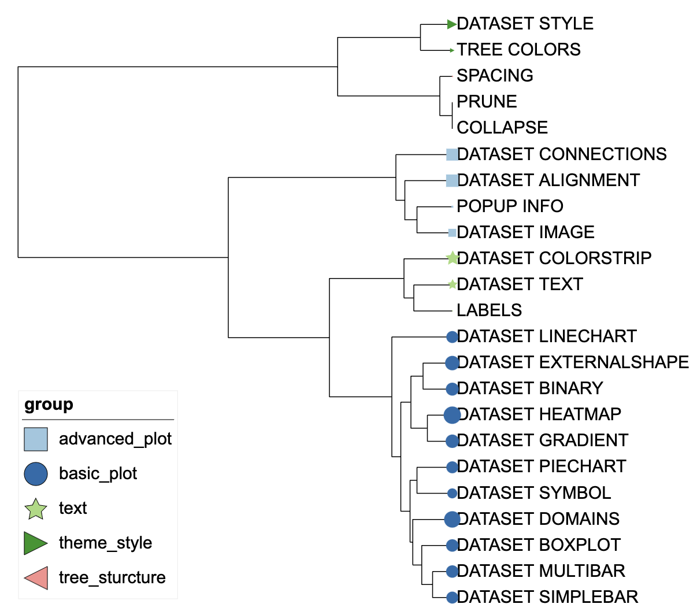
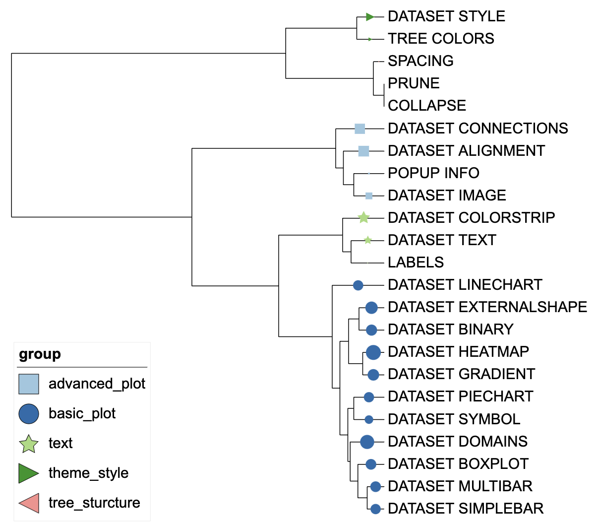
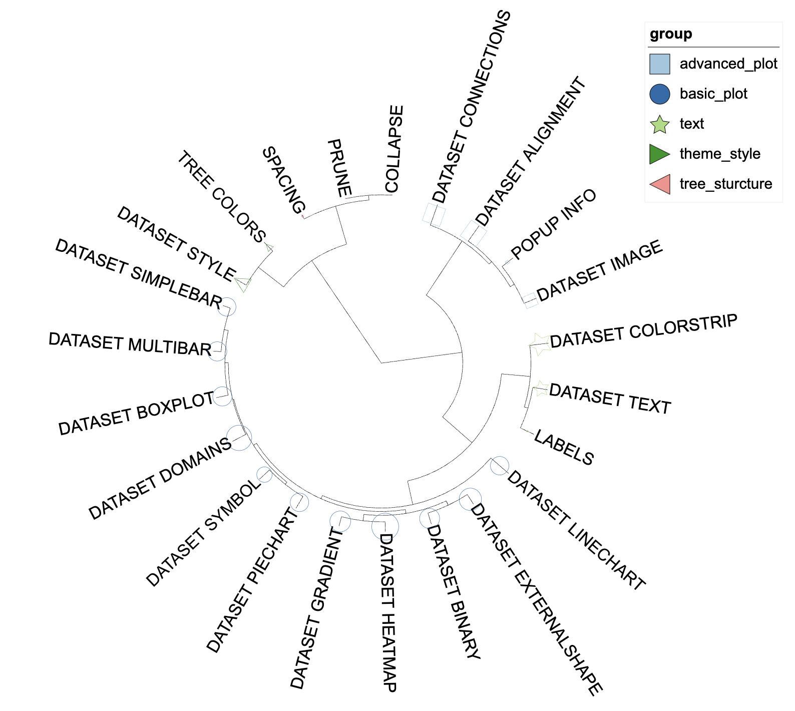

```{r, include = FALSE}
knitr::opts_chunk$set(
  collapse = TRUE,
  eval = FALSE,
  echo = TRUE,
  message=FALSE,
  warning=FALSE,
  comment = "#>"
)
```

## Introduction
The function of `DATASET_SYMBOL` is to display various symbol shapes directly on the branches of the tree. The `DATASET_GRADIENT` template belongs to the "Basic graphics" class (refer to the [Class]() for detail information).

Users typically add symbols to branches of a tree by inputting the branch names or nodes, as well as specifying the symbol's size, color, fill, and position.

This section describes how to use itol.toolkit to add symbols to branches of a tree. Without itol.toolkit, users have to set a lot of information manually, such as the size and the location of each symbol. The itol.toolkit automatically configures the size, shape, and color of symbols and adjust the size of all symbols globally.

## Draw symbols
This section uses [dataset 1](https://github.com/TongZhou2017/itol.toolkit/tree/master/inst/extdata/dataset1)  as an example to demonstrate adding symbols to branches of a tree based on metadata information. (refer to the  [Dataset](https://tongzhou2017.github.io/itol.toolkit/articles/Datasets.html) for detail information)

### Load data
The first step is to load the `newick` format tree file `tree_of_itol_templates.tree` and its corresponding metadata `template_parameters_count` and `template_groups`.

The following sample file `template_parameters_count` contains contains style parameters and data parameter information for the template type, with each column being a parameter. A value of 1 indicates that the template uses this parameter, while a value of 0 indicates that it is not used. And the sample file `template_groups.txt` is the category information for the template, the first column is the template name, and the second column is the category information.

The purpose of our data processing in this section is to display the number of parameters used by each template by adding symbols to the branches of the tree. The more parameters a template uses, the larger the symbol.
```{r load data}
library(itol.toolkit)
library(data.table)
library(ape)
tree <- system.file("extdata",
                    "tree_of_itol_templates.tree",
                    package = "itol.toolkit")
data("template_groups")
data("template_parameters_count")
tree <- read.tree(tree)
```
We can use different symbols for different groups. The program will automatically identify and set different colors and symbol shapes based on group information in `template_groups`. When the number of groups exceeds 6, the program will use different colors shapes to distinguish different groups automatically.
```{r symbol at the end of a branch}
template_parameters_count <- data.frame(template_parameters_count)
df_data <- cbind(template_groups,as.data.frame(rowSums(template_parameters_count)))
unit_30 <- create_unit(data = df_data,
                    key = "E030_symbol_1",
                    type = "DATASET_SYMBOL",
                    position = 1,
                    tree = tree)
```



We can use the "position" parameter to set the position where the symbol appears.Position should be a number between 0 and 1, specifying the ratio of the branch length where the center of the symbol should be positioned. Here, we set the position to 0.5 to place the symbol in the middle of the branch.
```{r symbol at the middle of a branch}
unit_31 <- create_unit(data = df_data,
                    key = "E031_symbol_2",
                    type = "DATASET_SYMBOL",
                    position = 0.5,
                    tree = tree)
```



We can determine whether the symbol is filled by changing the `fill` parameter. 0 represents a outlined symbol, and 1 represents a filled symbol.
```{r outlined symbol}
unit_32 <- create_unit(data = df_data,
                    key = "E032_symbol_3",
                    type = "DATASET_SYMBOL",
                    position = 0.5,
                    tree = tree,
                    fill = 0)
```



## Style modification
By modifying `unit@specific_themes$basic_plot$size_max`, we can adjust the maximum size of the symbol.
```{r resize symbols}
unit_32@specific_themes$basic_plot$size_max <- 40
```
