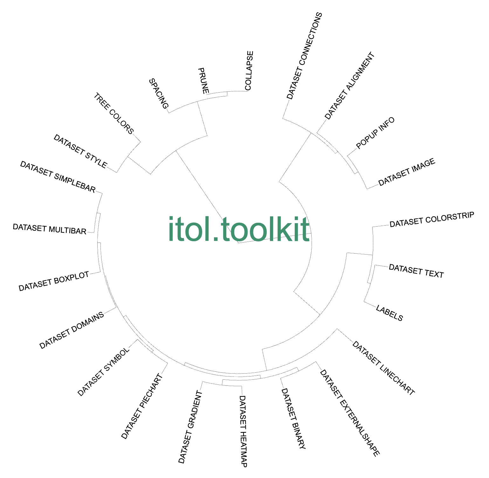
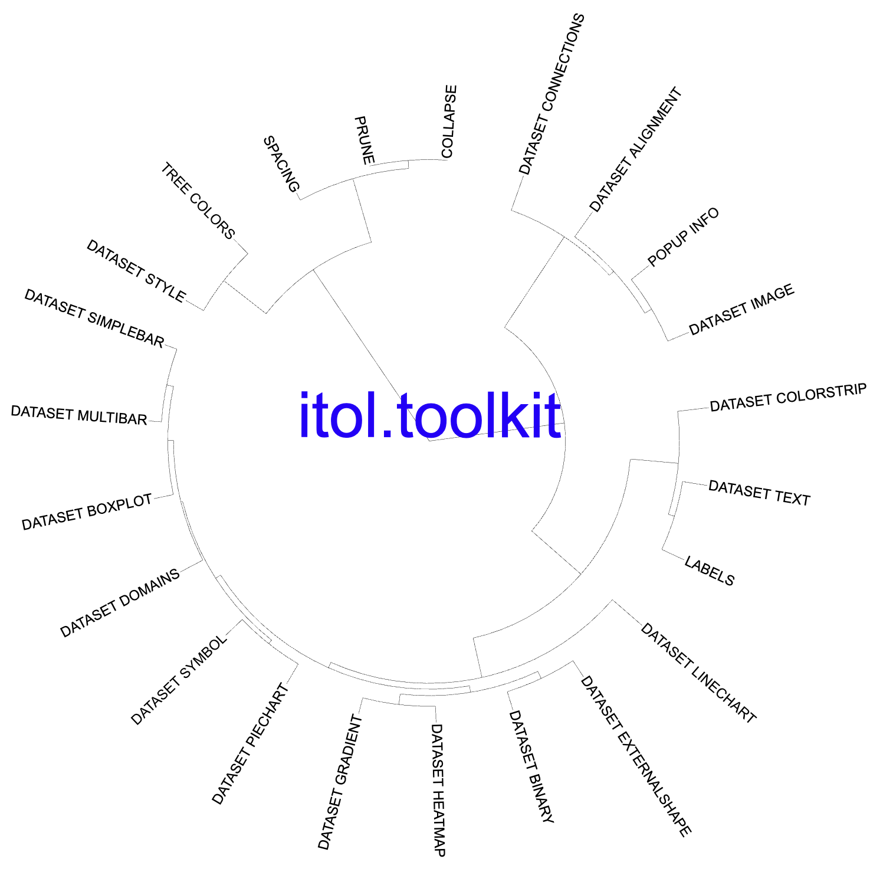
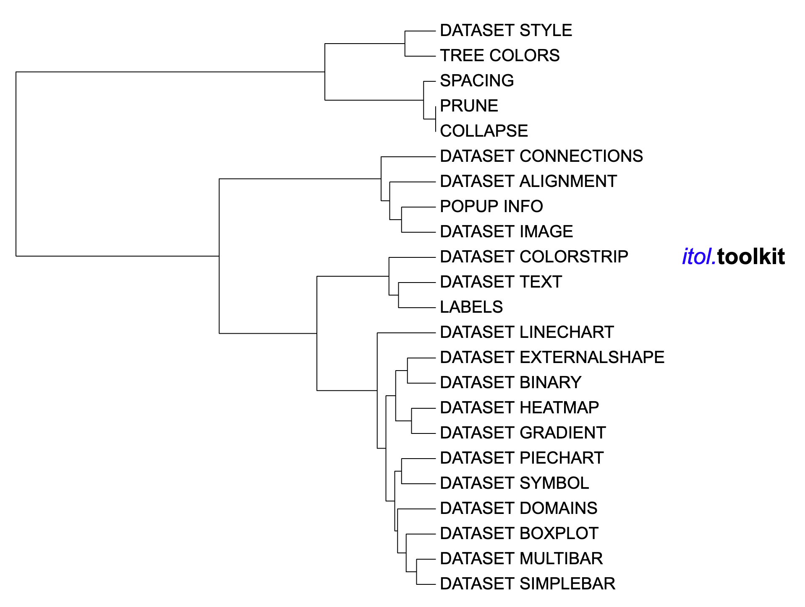

```{r, include = FALSE}
knitr::opts_chunk$set(
  collapse = TRUE,
  echo = TRUE,
  eval = FALSE,
  message=FALSE,
  warning=FALSE,
  comment = "#>"
)
```

## Introduction
The function of the `DATASET_TEXT` template is to associate each tree node with a single text either displayed on the branch or outside the node. For each label, the exact position, color, font style, size factor and degree of rotation can be specified.  The `DATASET_TEXT` template belongs to the "Text" class (refer to the [Class]() for detail information).

Typically, users need add text labels by specifying label text, position, color, style, size, and rotation angle for each node. Without itol.toolkit, users need input these information manually, reducing the efficiency of data processing and visualization preparation. The itol.toolkit allows users to complete visualization preparation more efficiently, especially by automatically generating color information based on the data. Moreover itol.toolkit retains the ability to set colors manually to meet most of users' needs.

## Text Label
This section uses [dataset 1](https://github.com/TongZhou2017/itol.toolkit/tree/master/inst/extdata/dataset1) to demonstrate adding text labels to the tree (refer to the  [Dataset](https://tongzhou2017.github.io/itol.toolkit/articles/Datasets.html) for detail information).

The first step is to load the newick format tree file "tree_of_itol_templates.tree". The purpose of data processing in this section is to add some text labels at specific locations in the tree. .
```{r load packages}
library(itol.toolkit)
library(data.table)
library(dplyr)
tree <- system.file("extdata",
                    "tree_of_itol_templates.tree",
                    package = "itol.toolkit")
```
Next we need to prepare the input data by storing it in a data frame with the first column containing the  node ID, the second column containing the corresponding text, and the third column containing the group data for automatic color configuration. 

In the case of data without the third column, the program will add colors automatically. Without setting the "color" parameter, itol.tookit will use the default palette (refer to [Color_Palette](链接) for detail information). Moreover, several other styles of text can be specified by users, which are described as follows:

- size_factor: size of text labels

- rotation: rotation angle of the text label

- position: -1, external label; a number between 0 and 1, specifying the ratio of the branch length where the center of the label should be positioned (ie. position 0 is exactly at the start of node branch, 0.5 is in the middle, and 1 is at the end).

- font_type: style of the font, can be normal, bold, italic or bold-italic
```{r text color defind by data}
df_data <- data.frame(id = "I1",
                      text = "itol.toolkit",
                      data="any")
unit_18 <- create_unit(data = df_data,
                       key = "E018_text_1",
                       type = "DATASET_TEXT",
                       size_factor = 6,
                       rotation = 66,
                       tree = tree)
write_unit(unit_18)
```



Users can input data with only only two columns(i.e., node ID and text), and set the color manually through the "color" parameter.
```{r text color defind by parameter}
df_data <- data.frame(id = "I1", text = "itol.toolkit")
unit_19 <- create_unit(data = df_data,
                       key = "E019_text_2",
                       type = "DATASET_TEXT",
                       size_factor = 6,
                       rotation=66,
                       color = "#0000FF",
                       tree = tree)
write_unit(unit_19)
```



Users can define multi-style text by adding different tags to the text:

- \<n> \</n> : normal text

- \<b> \</b> : bold

- \<i> \</i> : italic

- \<bi> \</bi> : bold italic

- \<sub> \</sub> : subscript

- \<sup> \</sup> : superscript

All parts of the label must be enclosed by one of the possible tags, including any space characters.

Each tag can be expanded with additional attributes:

- color: define a specific color for this part of the label

- size: define a size factor (e.g. 0.5 would make this part half the size)

- font: define a specific font family for this part of the label

Multiple styles can be used only on external labels (ie. position is set to -1), and that are not aligned to the tree.
```{r multi-style text}
df_data <- data.frame(id = "DATASET_COLORSTRIP", text = '<i color="#0000FF">itol.</i><b>toolkit</b>')
unit_20 <- create_unit(data = df_data,
                       key = "E020_text_3",
                       type = "DATASET_TEXT",
                       size_factor = 1,
                       rotation = 0,
                       position = -1,
                       color = "#000000",
                       tree = tree)
write_unit(unit_20)
```



## Style modification
Users can adjust the position of the text label with the following variables:

- `unit@common_themes$label$vertical`: Shift internal labels vertically by this amount of pixels (positive or negative)

- `unit@common_themes$label$below`: By default, internal labels will be placed above the branches. If LABELS_BELOW is set to 1, labels will be below the branches

- `unit_18@common_themes$label$straight`: If set to 1, tree rotation will not influence the individual label rotation
