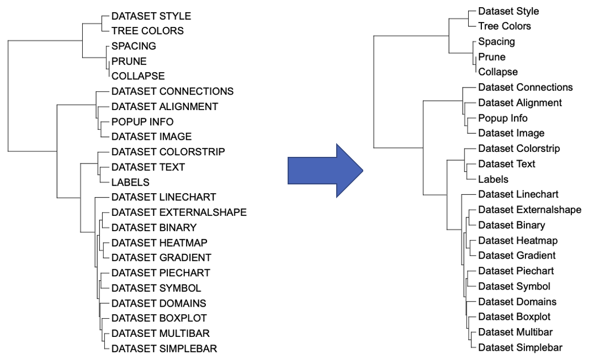

```{r, include = FALSE}
knitr::opts_chunk$set(
  collapse = TRUE,
  eval = FALSE,
  echo = TRUE,
  message=FALSE,
  warning=FALSE,
  comment = "#>"
)
```

## Introduction
The function of the `LABELS` template is to quickly change the text assigned to the leaf nodes, or to assign/change names for the internal nodes. Note that this function only changes the displayed text of the labels, you will still need to use the original tree node IDs in any other annotation files. The `LABELS` template belongs to the "Text" class (refer to the [Class]() for detail information).

Typically, the user modifies the label text by entering the branch/node name and a new label.

This section shows how to use itol.toolkit to modify the label text. The itol.toolkit makes the workflow coherent, allowing the user to process the label text in R environment and generate template files in bulk.

## Change the label text
This section provides an example of how to change the label text using [dataset 1](https://github.com/TongZhou2017/itol.toolkit/tree/master/inst/extdata/dataset1) (refer to the [Dataset](https://tongzhou2017.github.io/itol.toolkit/articles/Datasets.html) for detail information) document for detailed information).

The first step is to load the `newick` format tree file `tree_of_itol_templates.tree` and its corresponding metadata `template_groups`. The `template_groups` file contains which class each template belongs to.
```{r load data}
library(itol.toolkit)
library(stringr)
tree <- system.file("extdata",
                    "tree_of_itol_templates.tree",
                    package = "itol.toolkit")

data("template_groups")
```
Next, we process the data to generate new labels.
```{r data process}
df_data <- data.frame(id = template_groups$template,
                      new_label = str_to_title(str_replace_all(template_groups$template,"_"," ")))
```
The new label after processing is stored in the variable `df_data`, the first column is the branch name, the second column is the label text. In practice, users need to process or import label text data in this format.
```{r labels}
unit_17 <- create_unit(data = df_data,
                       key = "E017_label_1",
                       type = "LABELS",
                       tree = tree)
write_unit(unit_17)
```


