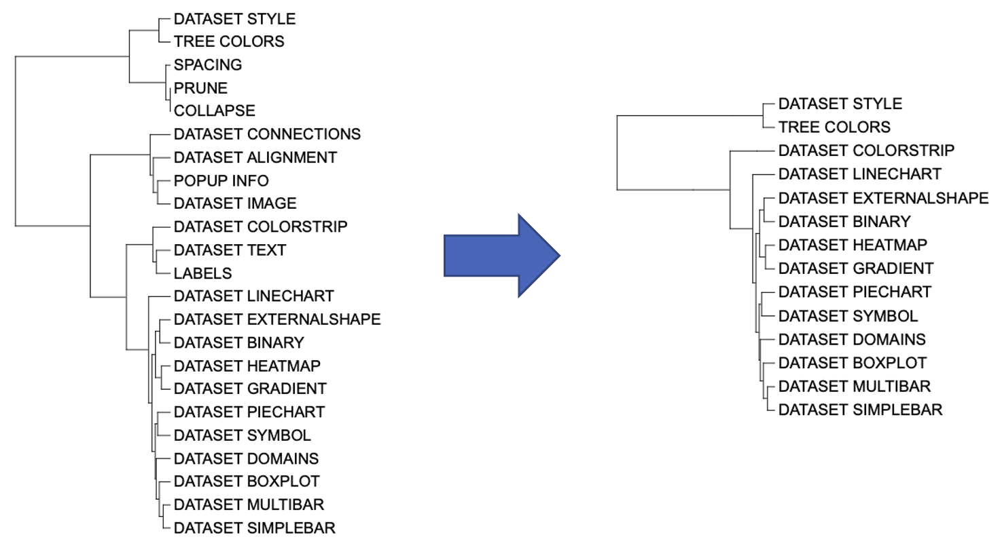
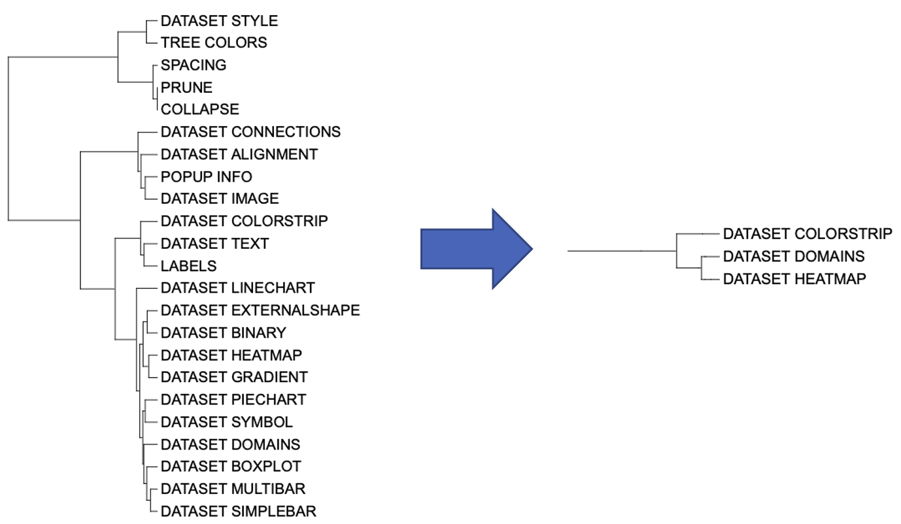

```{r, include = FALSE}
knitr::opts_chunk$set(
  collapse = TRUE,
  eval = FALSE,
  echo = TRUE,
  message=FALSE,
  warning=FALSE,
  comment = "#>"
)
```

## Introduction

The function of the `PRUNE` template is to select branches. The `PRUNE` template belongs to the "Tree structure" class (refer to the [Class]() for detail information).

Generally, users can select one branch or all branches within a node by entering the branch or node name. The selected branch will be included in the new phylogenetic tree, while the unselected branch will be excluded. This function is the only template function that changes the number of branches.

This section shows how to select branches in itol.toolkit. The process is very simple, and the main difficulty is that the user needs to determine which branches to be filtered. Without itol.toolkit, users have to perform data analysis and visualization preparation in fragmented environments. The itol.toolkit provides consistency to the workflow, allowing users to filter branches and output template files seamlessly.

## Prune nodes

This section uses [dataset 1](https://github.com/TongZhou2017/itol.toolkit/tree/master/inst/extdata/dataset1) as an example. (refer to the  [Dataset](https://tongzhou2017.github.io/itol.toolkit/articles/Datasets.html) for detail information)

The first step is to load the `newick` format tree file `tree_of_itol_templates.tree` and its corresponding metadata `df_frequence` and `template_parameters_count`.

The purpose of data processing in this section is to demonstrate how to select labels to be pruned according to users’ demands.
```{r load data}
library(itol.toolkit)
tree <- system.file("extdata",
                    "tree_of_itol_templates.tree",
                    package = "itol.toolkit")
df_frequence <- data.table::fread(system.file("extdata",
                                              "templates_frequence.txt",
                                              package = "itol.toolkit"))
data("template_parameters_count")
```

We can use both node and branch names to filter branches. For example, select the two types of templates that are most commonly used and have the most complex parameters: "theme_style" and "basic_plot".

```{r select node and tip}
ids <- df_frequence$templates
df_frequence[df_frequence > 1] <- 1 
df_frequence$templates <- ids
most_used_tip = df_frequence$templates[which.max(rowSums(df_frequence[,-1],
                                                         na.rm = T))]
select_item = c(most_used_tip, "theme_style","basic_plot")
unit_3 <- create_unit(data = select_item, 
                      key = "E003_prune_1", 
                      type = "PRUNE", 
                      tree = tree)
write_unit(unit_3)
```



We can also filter branches according to their names. For example, E004 selects branches beginning with "DATASET_", which typically have complex parameter and format template requirements.

```{r select tip}
select_tip = hub@tree$main$tip.label[startsWith(hub@tree$main$tip.label,
                                                "DATASET_")]
unit_4 <- create_unit(data = select_tip, 
                                 key = "E004_prune_2", 
                                 type = "PRUNE", 
                                 tree = tree)
write_unit(unit_4)
```


We can also filter branches based on other information. For example, we used `template_parameters_count` data to filter templates with more than 30 parameters in `unit_5`.

```{r select tip with condition}
tpc <- template_parameters_count
select_tip = row.names(tpc)[rowSums(tpc) > 30]
unit_5 <- create_unit(data = select_tip, 
                      key = "E005_prune_3", 
                      type = "PRUNE", 
                      tree = tree)
write_unit(unit_5)
```



## Note
As the only function that changes the topology of a tree, `PRUNE` typically exists in the pre processing stage of a workflow, so it cannot be reflected in published papers. However, R language users are more likely to use `ape::drop.tip` to achieve this requirement, so the application prospects of this template are worrying. Unless users need to avoid relying too much on tools, it is possible to use this function on demand.
