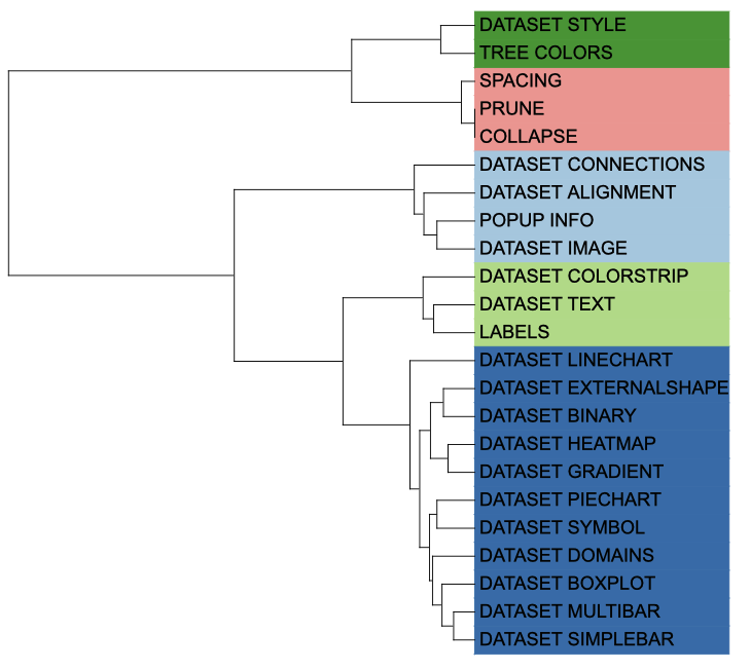
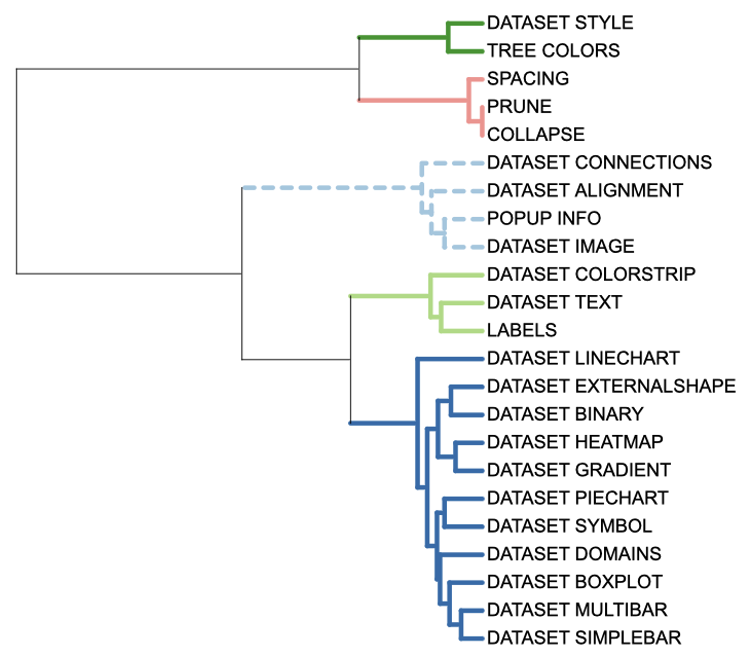
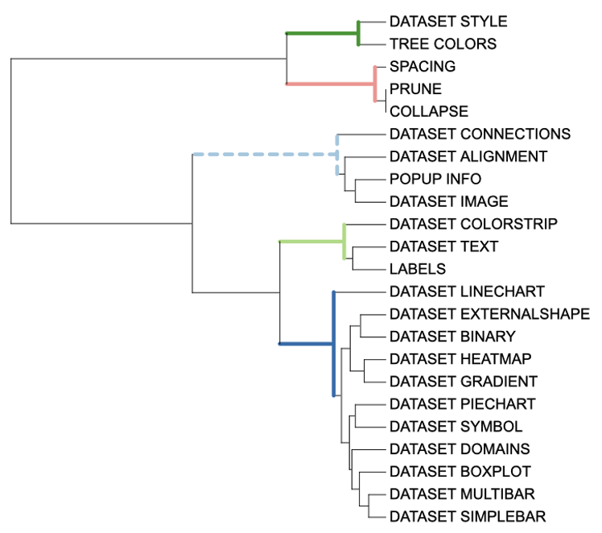
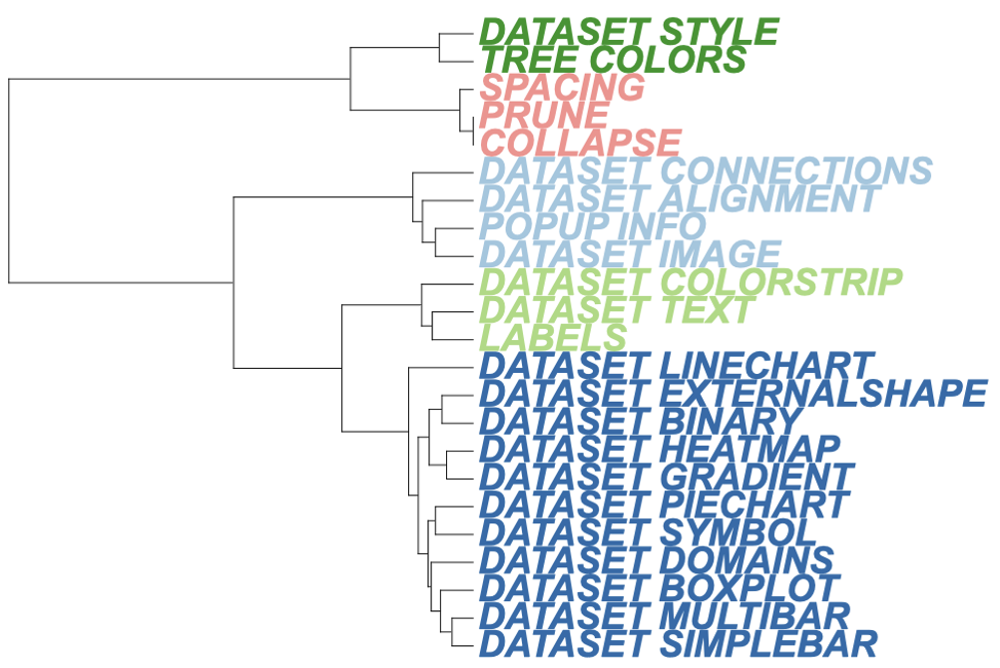
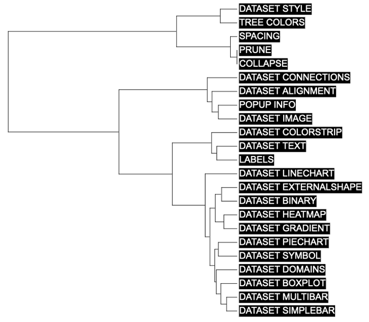

```{r, include = FALSE}
knitr::opts_chunk$set(
  collapse = TRUE,
  eval = FALSE,
  echo = TRUE,
  message=FALSE,
  warning=FALSE,
  comment = "#>"
)
```


## Introduction
The `TREE_COLORS` allows you to set the style of branches at any level. It has five attributes: "range", "clade", "branch", "label", and "label_background". While style parameters is simple of `TREE_COLORS`, the data parameters are extremely complex. The `Style` template belongs to the "Tree structure" class (refer to the [Class]() for detail information).

To set the style of a branch or node, users must enter the name of the branch tip or node and the attribute such as color, label, style, and size.The selected branch will then display the new styles as defined by the specified attribute. Although this function provides the most comprehensive templates for modifying tree style, its complexity in data parameters proves to be a great challenge for users.

This section shows how to use itol.toolkit to modify the style. The itol.toolkit significantly reduces the difficulty level for using iTOL by enabling automatic data recognition. Without itol.toolkit, users would have to organize various attribute parameters and their corresponding input data manually. With the itol.toolkit, the entire workflow becomes more cohesive, and users can directly output the template files once they have confirmed which data to use.

## Regular flow
This section uses [dataset 1](https://github.com/TongZhou2017/itol.toolkit/tree/master/inst/extdata/dataset1) as an example to show how to draw the line chart. (refer to the  [Dataset](https://tongzhou2017.github.io/itol.toolkit/articles/Datasets.html) for detail information)

### Load data
The first step is to load the `newick` format tree file `tree_of_itol_templates.tree` and its corresponding metadata `df_frequence`. 

```{r load data}
library(itol.toolkit)
tree <- system.file("extdata",
                    "tree_of_itol_templates.tree",
                    package = "itol.toolkit")
hub <- create_hub(tree = tree)
data("template_groups")
```

If the user enters all four columns, the program will figure out which is the subclass and which is the color.

We can use the "range" attribute to set color of the tip label area. Unlike the "label_background" attribute, the "range" attribute color action range is consistent in the area of each label. In `unit_7`, we only use two columns to show hot use these function. The attribute are fed to the `subtype` parameter. Based on the input data, the `create_unit` function treat the first column as tip id, and the second columns as the "range" information (whatever the header is). Moreover, the color is also generated by the second column of input data. Also, colors can be defined using the `color` parameter. As a result, the program has handle all possible cases automatically, lowering the threshold at which users are preparing for input data.
```{r tree colors range}
unit_7 <- create_unit(data = template_groups, 
                      key = "E007_tree_colors_1", 
                      type = "TREE_COLORS", 
                      subtype = "range", 
                      tree = tree)
write_unit(unit_7)
```



We can use the "clade" attribute to apply color adjustments to all branches contained in a node . Like `unit_7`, we used only 2 columns data  to implement the "branch" attribute in `unit_8`. The attribute are fed to the `subtype` parameter. The line type is defined by the `line_type` parameter, which controls whether the line is a dotted line or not, and here we define the different line types as a set of vectors. The line thickness is defined by the `size_factor` parameter.

In `unit_8`, five discrete colors are generated according to the second column of input data, which has five groups. Colors can also be defined using the color parameter.
```{r tree colors clade in node}
df_data <- data.frame(id = unique(template_groups$group), 
                      data = unique(template_groups$group))
unit_8 <- create_unit(data = df_data, 
                      key = "E008_tree_colors_2", 
                      type = "TREE_COLORS", 
                      subtype = "clade", 
                      line_type = c(rep("normal",4),"dashed"),
                      size_factor = 5, 
                      tree = tree)
write_unit(unit_8)
```



We can use the "branch" attribute to adjust color of the node or tip like "clade" attribute. However, "branch" attribute does not broadcast these settings to its offspring branches. See `unit_9`
```{r tree colors branch in node}
unit_9 <- create_unit(data = df_data, 
                      key = "E009_tree_colors_3", 
                      type = "TREE_COLORS", 
                      subtype = "branch", 
                      line_type = c(rep("normal",4),"dashed"),
                      size_factor = 5, 
                      tree = tree)
write_unit(unit_9)
```



We can use "label" attribute to adjust colors and font styles at the branch level. We  also used only 2 columns data  to implement the "branch" attribute in  `unit_10`. The font type is defined by the `font_type parameter`, which controls whether the lines are bold or italic; The font size is defined by the `size_factor` parameter. 
```{r tree colors label in tip}
unit_10 <- create_unit(data = template_groups,
                       key = "E010_tree_colors_4", 
                       type = "TREE_COLORS", 
                       subtype = "label", 
                       font_type = "bold-italic",
                       size_factor = 2, 
                       tree = tree)
write_unit(unit_10)
```



We can use the "label_background" attribute to adjust the color scheme of the label background at the branch level. We only used 2 columns of information to show how to implement the "label_background" attribute in `unit_11`. Usually, the background is a uniform color, so the color parameter defines a single color. However, you can set different colors by entering a vector of colors. If no color was set, `itol.toolkit` will automatically set colors based on the data. In practice, it's important to note that backgrounds often don't work the first time you drag them into iTOL, and you need to switch between the ring, rectangle, and unrooted tree types to make them work.
```{r tree colors label background in tip}
unit_11 <- create_unit(data = template_groups, 
                       key = "E011_tree_colors_5", 
                       type = "TREE_COLORS", 
                       subtype = "label_background",
                       color = "#000000", 
                       tree = tree)
write_unit(unit_11)
```



Of all templates, `TREE_COLORS` is one of the most frequently used function  and highly recommended by authors. The itol.toolkit enables users to make fewer mistakes, and save effort in complex function and data preparation.
