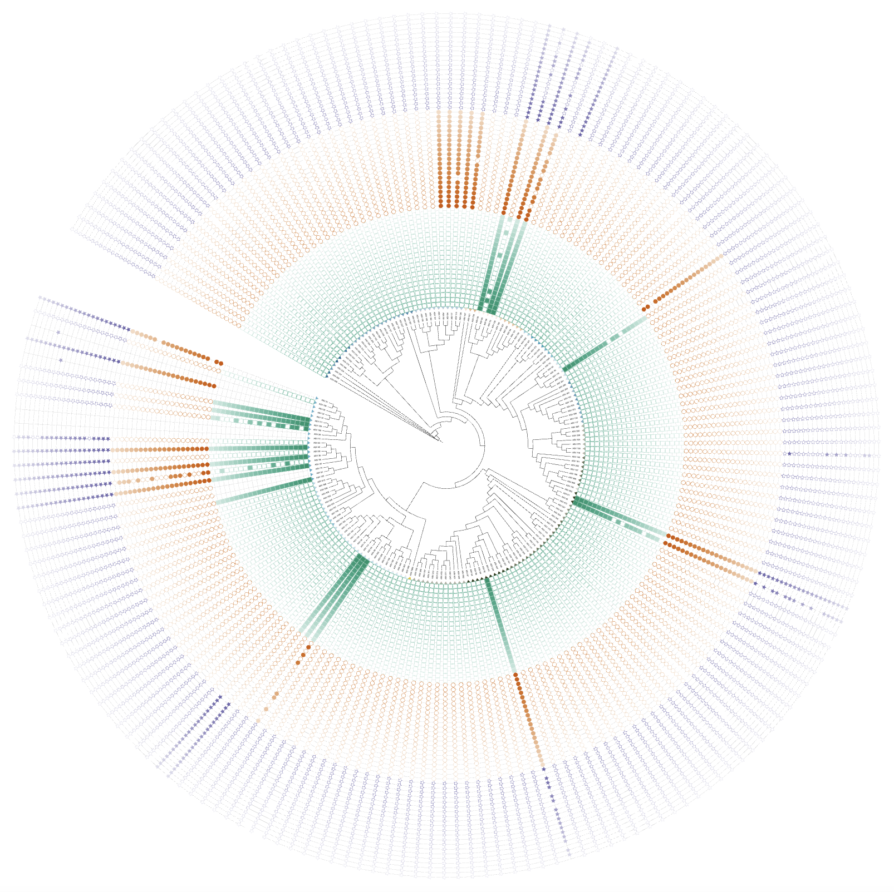

```{r, include = FALSE}
knitr::opts_chunk$set(
  collapse = TRUE,
  eval = FALSE,
  echo = TRUE,
  message=FALSE,
  warning=FALSE,
  comment = "#>"
)
```

## Overview

Updates:

1. **New**: Added dual-factor coloring support for binary dataset visualization.
2. **Fix**: Fixed legend order issues in DATASET_COLORSTRIP, DATASET_SYMBOL, and DATASET_DOMAINS functions.

## 1. Dual-Factor Coloring for Binary Dataset

Added support for dual-factor coloring in binary dataset visualization, allowing users to create more informative and visually appealing visualizations.

### Data Preparation

```{r data_setup}
# Set working directory for output files
setwd("~/Downloads/")

# Load required libraries
library(itol.toolkit)    # Main package for iTOL visualization
library(dplyr)           # Data manipulation and transformation
library(data.table)      # Fast file reading and data operations
library(ape)             # Phylogenetic tree operations
library(stringr)         # String manipulation utilities
library(tidyr)           # Data tidying and reshaping

# Load example data files
tree_1 <- system.file("extdata", "dataset4/otus.contree", package = "itol.toolkit")
data_file_1 <- system.file("extdata", "dataset4/annotation.txt", package = "itol.toolkit")
data_file_2 <- system.file("extdata", "dataset4/otutab_high.mean", package = "itol.toolkit")

# Read data files
data_1 <- data.table::fread(data_file_1)
data_2 <- data.table::fread(data_file_2)
```

### Domain Visualization

Demonstrate the existing domain annotation feature that supports dual-factor coloring:

```{r domain_visualization}
set.seed(123)  # Set random seed for reproducible results

# Create domain annotation unit with dual-factor coloring support
unit_6 <- create_unit(
  data = data_1 %>% select(ID, Class, Family),
  key = "New_in_v1.1.8",
  type = "DATASET_DOMAINS",
  color = "wesanderson",
  shape = "TL",
  tree = tree_1
)
```

### Binary Data Processing

```{r binary_data_preparation}
# Function to generate fluctuating columns for demonstration
generate_fluctuation_columns <- function(df, base_col, num_cols, fluctuation_range) {
  set.seed(123)  # Ensure reproducible results
  
  for (i in 1:num_cols) {
    col_name <- paste0(base_col, "_", i)
    # Generate values with random fluctuation around the base column
    df[[col_name]] <- df[[base_col]] * (1 + runif(nrow(df), -fluctuation_range, fluctuation_range))
  }
  return(df)
}

# Prepare data for binary visualization
# Select relevant columns and generate multiple samples
data_3 <- data_1 %>% select(ID, Asia, North_America, South_America)

# Generate 20 columns for each region with ±15% fluctuation
data_3 <- generate_fluctuation_columns(data_3, "Asia", 20, 0.15)
data_3 <- generate_fluctuation_columns(data_3, "North_America", 20, 0.15)
data_3 <- generate_fluctuation_columns(data_3, "South_America", 20, 0.15)

# Round numeric values for cleaner visualization
data_3[, 2:ncol(data_3)] <- round(data_3[, 2:ncol(data_3)])

# Enhanced data transposition function
transpose_with_first_column_as_header <- function(dt) {
  # Input validation
  if (!is.data.table(dt)) {
    stop("Input must be a data.table object.")
  }
  
  # Extract first column values as new column names
  new_col_names <- dt[[1]]
  
  # Transpose the data (excluding the first column)
  transposed_dt <- transpose(dt[, -1, with = FALSE])
  
  # Set column names from the first column data
  setnames(transposed_dt, new_col_names)
  
  # Add original column names as a new "Sample" column
  transposed_dt[, "Sample" := names(dt)[-1]]
  
  # Reorder columns to put Sample column first
  setcolorder(transposed_dt, c("Sample", new_col_names))
  
  return(transposed_dt)
}

# Apply transposition and prepare for binary visualization
data_3_t <- transpose_with_first_column_as_header(data_3)

# Clean sample names and sort for better organization
data_3_t <- data_3_t %>% 
  mutate(group = stringr::str_remove(stringr::str_remove(Sample, "\\d+$"), "_$")) %>% 
  arrange(Sample)
```

### Binary Unit Creation

Create a binary visualization unit with enhanced styling:

```{r binary_unit_creation}
# Create binary dataset unit with improved parameters
unit_7 <- create_unit(
  data = data_3,
  key = "New_in_v1.1.11",
  type = "DATASET_BINARY",
  color = "wesanderson",
  tree = tree_1
)

# Customize symbol height for optimal visualization
unit_7@specific_themes$basic_plot$height_factor <- 0.4
```

### Output Generation

Combine all units and generate the final output:

```{r output_generation}
# Create hub object and combine all visualization units
hub_1 <- create_hub(tree_1)
hub_1 <- hub_1 + unit_6 + unit_7

# Write output files with tree data
write_hub(hub_1, "~/Downloads/", with_tree = TRUE)
```



## 2. Legend Order Fixes

Fixed legend ordering issues in specific dataset functions to ensure consistent behavior with user input data.

### Problem Description

Previously, legends were ordered alphabetically using `levels(as.factor())`, causing:
- Color, shape, and label orders to be inconsistent
- Users could not predict final legend order
- Poor user experience and confusion

### Affected Functions

- **DATASET_COLORSTRIP**: Fixed color and label order mismatch
- **DATASET_SYMBOL**: Fixed shape, color, and label order mismatch  
- **DATASET_DOMAINS**: Fixed shape, color, and label order mismatch

### Solution Implementation

All fixes use a unified approach to maintain original data frame order:

```{r}
# Before (problematic code)
common_themes$legend$colors <- levels(as.factor(color))
common_themes$legend$labels <- levels(as.factor(data[[colname_data]]))

# After (fixed code)
# Get unique labels and corresponding attributes, preserving original order
unique_data <- data.frame(
  label = data[[colname_data]], 
  color = color, 
  shape = shape,  # if applicable
  stringsAsFactors = FALSE
)
unique_data <- unique_data[!duplicated(unique_data$label), ]

common_themes$legend$colors <- unique_data$color
common_themes$legend$labels <- unique_data$label
common_themes$legend$shapes <- unique_data$shape  # if applicable
```

### Example Usage

```{r}
# Load required libraries
library(itol.toolkit)
library(tibble)

# Define tree structure (example)
tree <- "((tip1,tip2),(tip3,tip4));"

# Define colors in desired order
shed_color <- tribble(
  ~Shed, ~Shed_color,
  "Farm A shed 3", "#aec7e8",    # Will appear first in legend
  "Farm A shed 6", "#1f77b4"     # Will appear second in legend
)

# Create sample data frame
df <- data.frame(
  id = c("tip1", "tip2", "tip3", "tip4"),
  Shed = c("Farm A shed 3", "Farm A shed 6", "Farm A shed 3", "Farm A shed 6")
)

# Create unit - legend order will match your data frame order
unit <- create_unit(data = df,
  key = "color_shed_colorstrip",
  type = "DATASET_COLORSTRIP",
  tree = tree)
```

### Benefits

- **Consistent Ordering**: Legend order now matches user-defined data frame order
- **User Control**: Users can control legend order by arranging their data frames
- **Reliable Behavior**: All affected functions now behave consistently
- **Better Alignment**: Colors, shapes, and labels maintain proper correspondence


