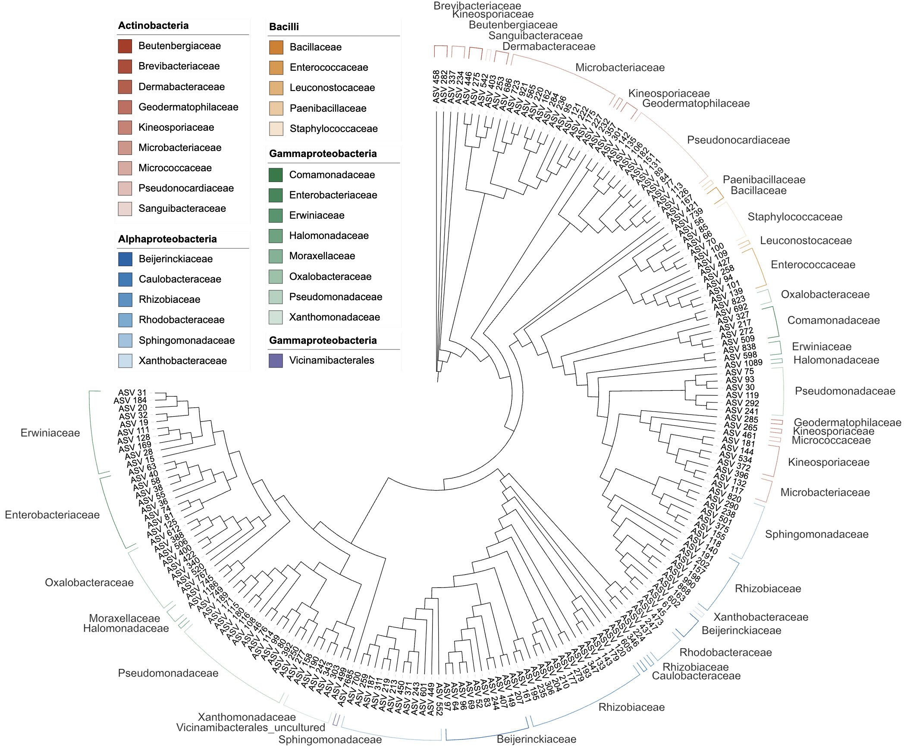
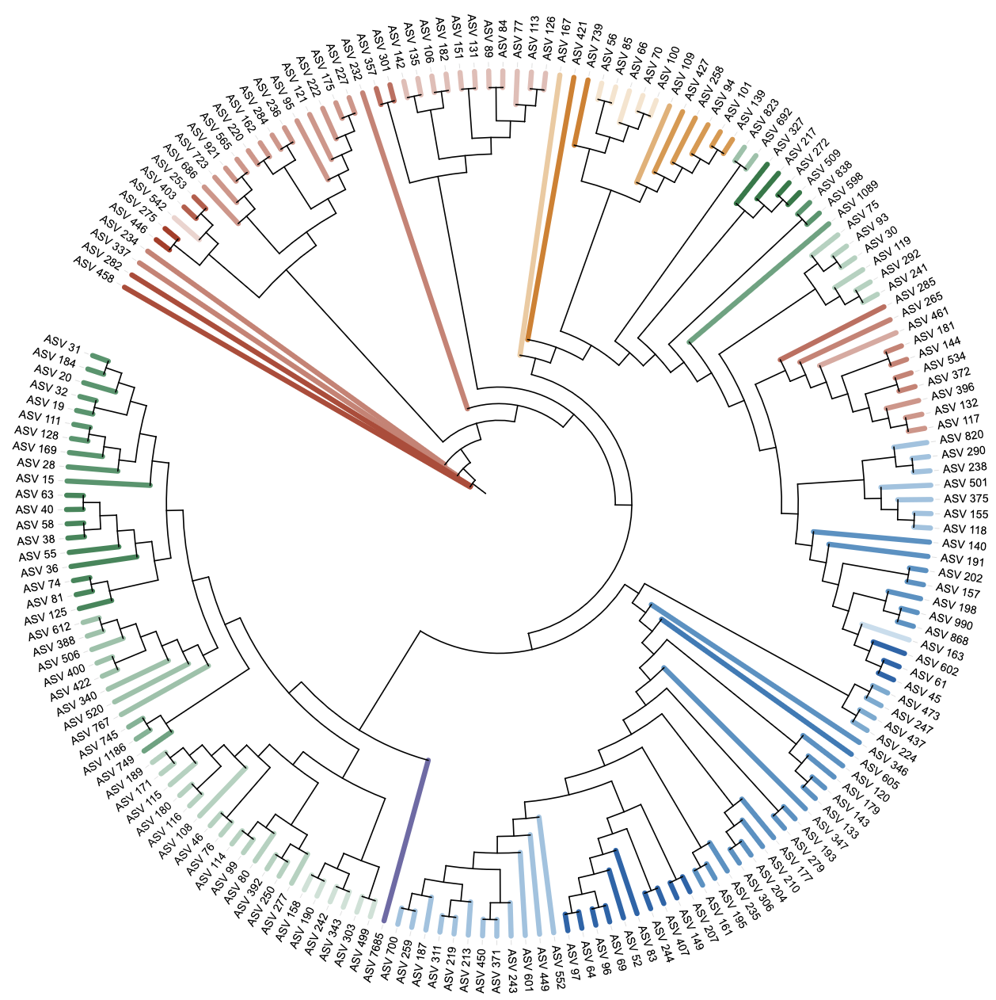
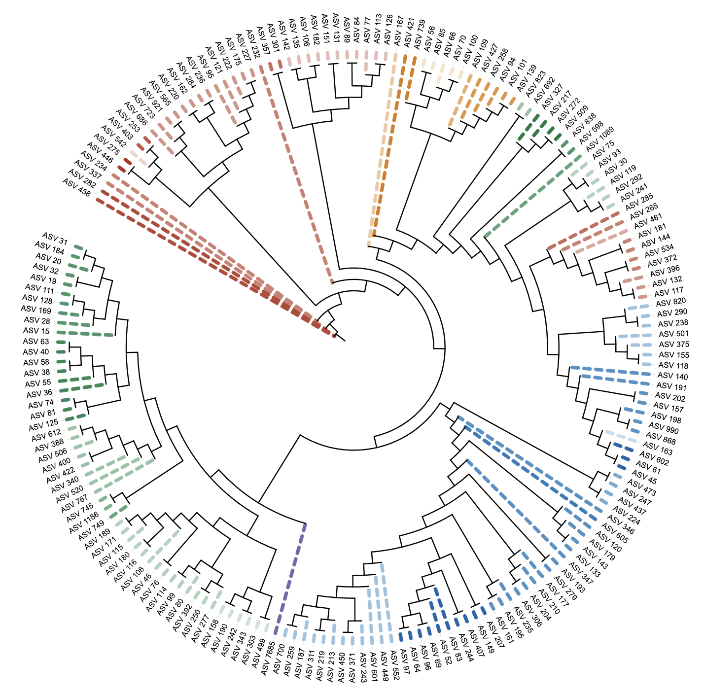
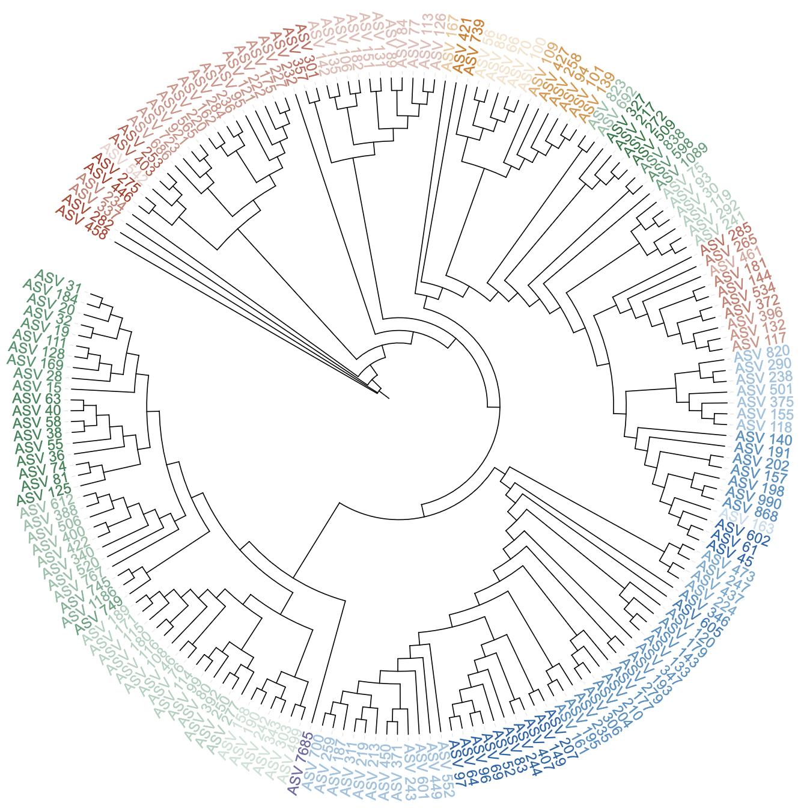
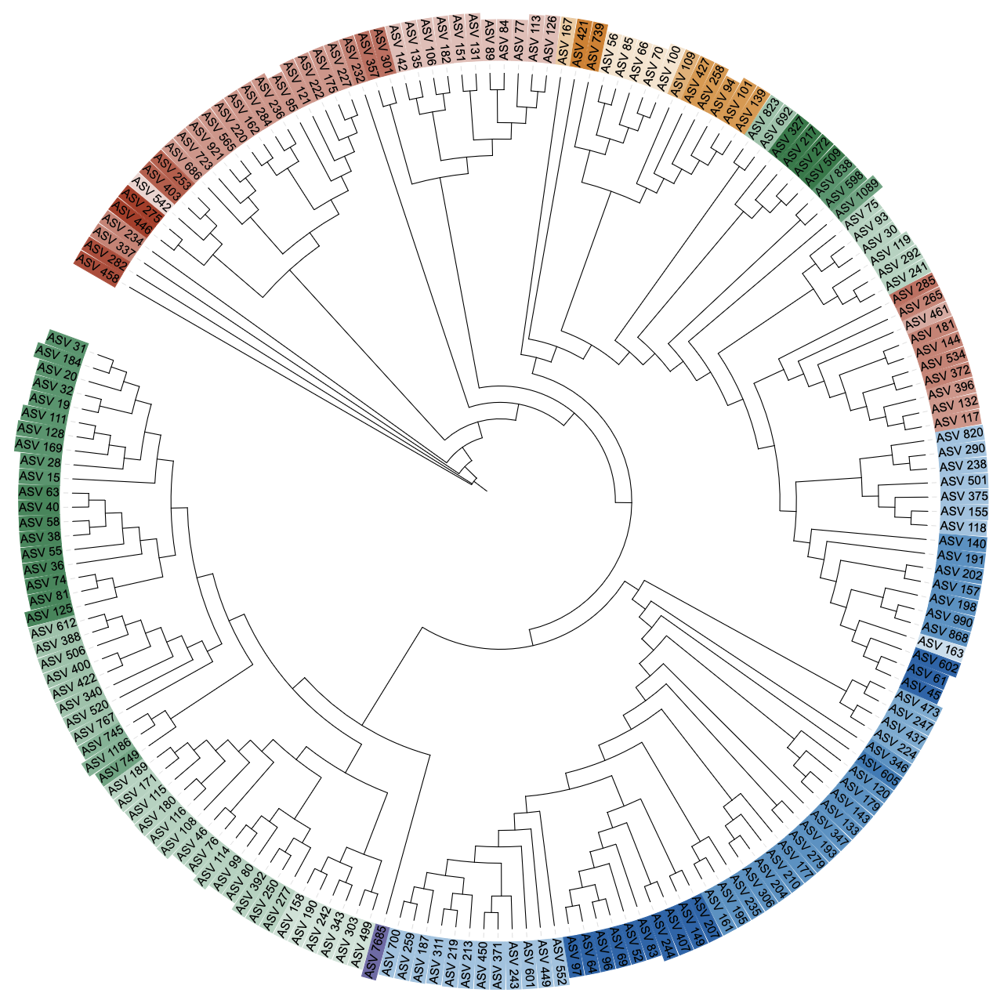

```{r, include = FALSE}
knitr::opts_chunk$set(
  collapse = TRUE,
  eval = FALSE,
  echo = TRUE,
  message = FALSE,
  warning = FALSE,
  comment = "#>"
)
```

## Overview

Starting with the v1.2 series, the focus is on enhancing coloring functionality. Dual-factor coloring has been preliminarily explored in two existing features: DOMAINS implemented shape-color and color-color dual-factor coloring, while BINARY tested color parameter extensions by directly defining dual-factor coloring in the color parameter, though only supporting default palett. In v1.2.0, dual-factor coloring is now extended to all five TREE_COLORS subtypes, with the new color parameter syntax supplemented by a third element for palette specification.

Updates:

1. New: TREE_COLORS supports dual-factor coloring (main group + gradient).
2. New: The 3rd element of `color` can specify a color set for base hues.
3. Fix: Legend is now rebuilt from the final DATA right before output, ensuring LEGEND order matches the DATA block and paving the way for unified legend handling in future refactors.
4. Fix: `write_unit()` now reports output file paths for user confirmation.
5. Fix: TREE_COLORS label subtype accepts `font_type = "normal"` (and vectorization works). Previously, providing "normal" could be rejected as unsupported.


## 1. TREE_COLORS Dual-Factor Coloring

Dual-factor coloring follows the DOMAINS/BINARY strategy: the first factor defines a base hue per group; the second factor creates within-group gradients starting from the base hue.

All TREE_COLORS subtypes support dual-factor coloring: `range`, `clade`, `branch`, `label`, and `label_background`.

### Range subtype example (dual-factor coloring)

```{r}
library(itol.toolkit)
library(dplyr)

# Load dataset4
tree_1 <- system.file("extdata","dataset4/otus.contree",package = "itol.toolkit")
data_file_1 <- system.file("extdata","dataset4/annotation.txt",package = "itol.toolkit")
data_1 <- data.table::fread(data_file_1)

# Create unit with dual-factor coloring (Class as main factor, Family as gradient)
u_range <- create_unit(
  data = data_1 %>% select(ID, Class, Family),
  key = "TC_dual_range",
  type = "TREE_COLORS",
  subtype = "range",
  color = c("Class", "Family", "nejm"),
  tree = tree_1
)

# Write unit - v1.2.0 now reports output path for user confirmation
write_unit(u_range)
```



### Clade subtype example (dual-factor coloring)

```{r}
# Dual-factor coloring also works with subtype = "clade"
u_clade <- create_unit(
  data = data_1 %>% select(ID, Class, Family),
  key = "TC_dual_clade",
  type = "TREE_COLORS",
  subtype = "clade",
  color = c("Class","Family","nejm"),  # optional palette
  line_type = "normal",               # or "dashed"; can also be a vector
  size_factor = 4,                    # line width
  tree = tree_1
)

write_unit(u_clade)
```



### Branch subtype example (dual-factor coloring)

```{r}
# Dual-factor coloring also works with subtype = "branch"
u_branch <- create_unit(
  data = data_1 %>% select(ID, Class, Family),
  key = "TC_dual_branch",
  type = "TREE_COLORS",
  subtype = "branch",
  color = c("Class","Family","nejm"),  # optional palette
  line_type = "dashed",               # example using dashed lines
  size_factor = 3,                    # line width
  tree = tree_1
)

write_unit(u_branch)
```



### Label subtype example (dual-factor coloring)

```{r}
# Dual-factor coloring also works with subtype = "label"
u_label <- create_unit(
  data = data_1 %>% select(ID, Class, Family),
  key = "TC_dual_label",
  type = "TREE_COLORS",
  subtype = "label",
  color = c("Class","Family","nejm"),  # optional palette
  font_type = "normal",
  size_factor = 2,
  tree = tree_1
)

write_unit(u_label)
```



### Label background subtype example (dual-factor coloring)

```{r}
# Dual-factor coloring also works with subtype = "label_background"
u_label_bg <- create_unit(
  data = data_1 %>% select(ID, Class, Family),
  key = "TC_dual_label_bg",
  type = "TREE_COLORS",
  subtype = "label_background",
  color = c("Class","Family","nejm"),  # optional palette
  tree = tree_1
)

write_unit(u_label_bg)
```



## 2. Third element of `color` as color set

Optionally specify a color set in the 3rd element of `color` for base hues of the main groups.

```{r}
u2 <- create_unit(
  data = data_1 %>% select(ID, Class, Family),
  key = "TC_dual_set",
  type = "TREE_COLORS",
  subtype = "range",
  color = c("Class","Family","wesanderson"),  # base hues from this set
  tree = tree_1
)
```

Notes:

- If the 3rd element exists in `get_color(set = 'ls')`, it is used; otherwise it falls back to defaults.
- With a single column name (e.g., `color = "Group"`), discrete palette mapping is applied.

## 3. Output pipeline improvement

Starting from v1.2.0, before writing the header lines, the final DATA is constructed first; then the legend (labels/colors/shapes) is rebuilt directly from that DATA order; finally, the header and data are written. On the surface, this guarantees consistency between the DATA block and the legend. More importantly, this change prepares a unified, centralized handling for legend and related metadata, simplifying future refactors and ensuring stable ordering across different dataset types.

```{r}
# Use dataset4 for the pipeline demonstration
u_ex <- create_unit(
  data = data_1 %>% select(ID, Class, Family),
  key = "TC_pipeline",
  type = "TREE_COLORS",
  subtype = "range",
  color = c("Class","Family","table2itol"),
  tree = tree_1
)

# Output to a temporary file
out_file <- tempfile(fileext = ".txt")
write_unit(u_ex, out_file)

# Inspect the template file to confirm:
# - LEGEND_LABELS order matches the last column (labels) in DATA
# - LEGEND_COLORS are aligned one-to-one with LEGEND_LABELS
# readLines(out_file) |> writeLines()
```

Note: In previous versions, legend could be composed before the final DATA selection/ordering, which sometimes caused mismatches. The new pipeline removes this class of issues by deriving legend directly from the final DATA.

### Label font type bug fix (normal)

Background:
- In older behavior, when using `type = "TREE_COLORS", subtype = "label"`, passing `font_type = "normal"` could be rejected as "Unsupported font type parameter".
- This was inconsistent with other accepted values ("bold", "italic", "bold-italic", "").

What changed in v1.2.0:
- The `label` subtype now explicitly allows `font_type = "normal"`.
- Scalar `font_type` is correctly vectorized to match the number of rows; existing per-row vectors continue to work.

How to use:
```{r}
unit_label <- create_unit(
  data = data_1 %>% select(ID, Class, Family),
  key = "v120_label_normal",
  type = "TREE_COLORS",
  subtype = "label",
  color = c("Class","Family","nejm"),   # dual-factor coloring still applies
  font_type = "normal",                           # now accepted
  size_factor = 2,
  tree = tree_1
)
write_unit(unit_label, tempfile())
```

Notes:
- You can still use "bold", "italic", or "bold-italic"; or supply a character vector (length = nrow(data)) for row-wise styles.
- If omitted, `font_type` defaults to "normal".
