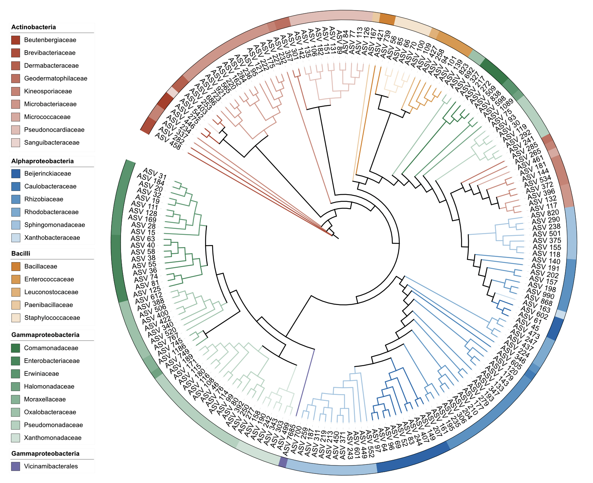
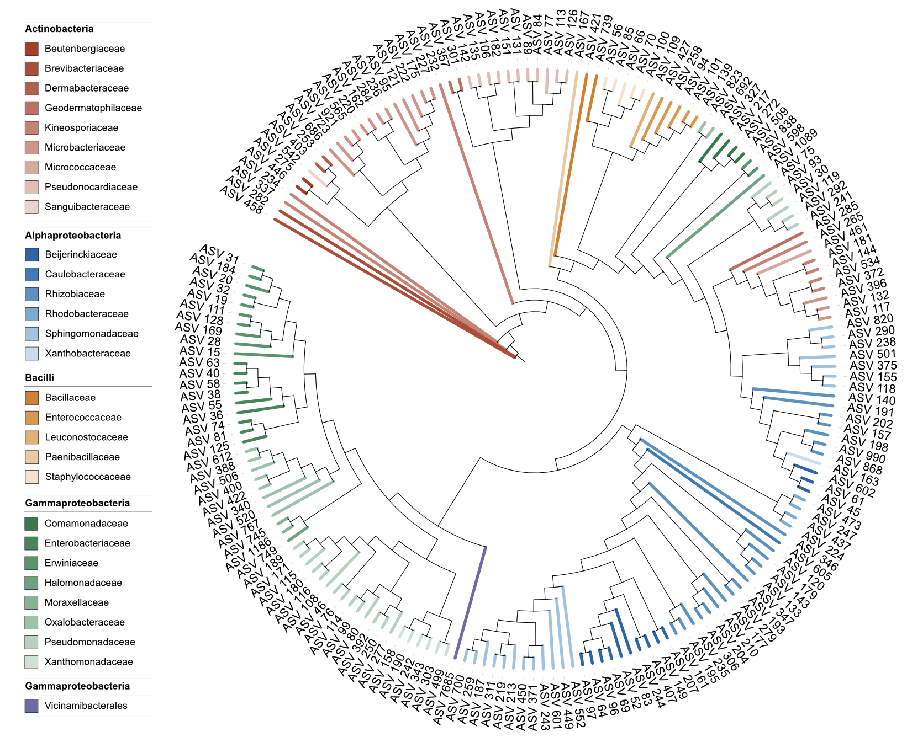
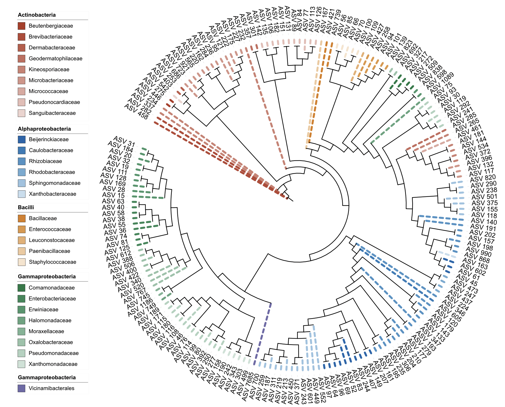
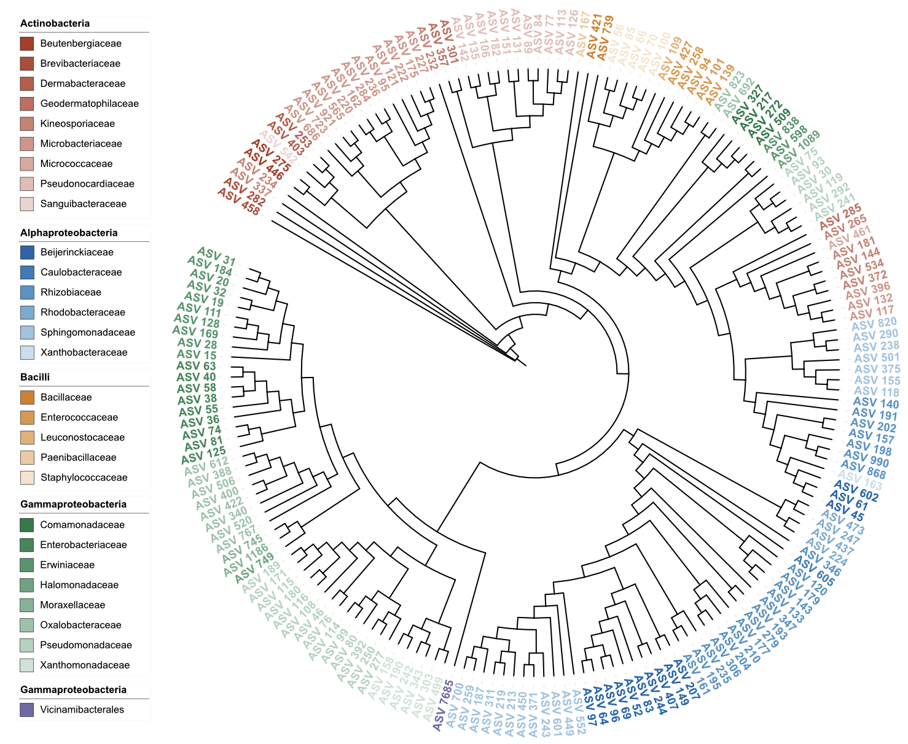
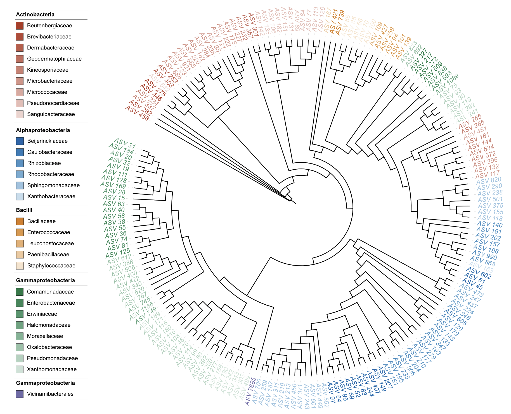
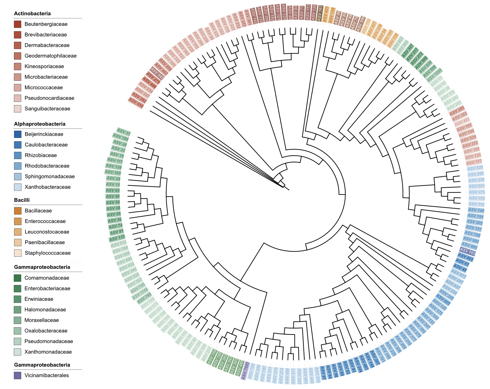
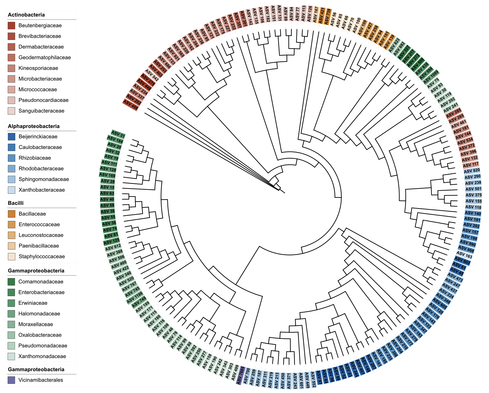
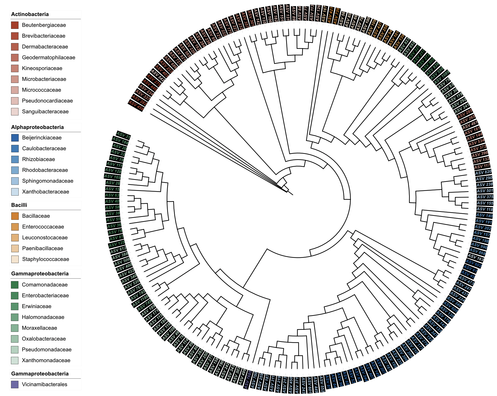

```{r, include = FALSE}
knitr::opts_chunk$set(
  collapse = TRUE,
  eval = FALSE,
  echo = TRUE,
  message = FALSE,
  warning = FALSE,
  comment = "#>"
)
```

## Overview

This release (v1.2.1) extends dual-factor coloring support to `DATASET_COLORSTRIP` and `DATASET_STYLE`, continuing the enhancement of coloring functionality in the v1.2 series.

Updates:

1. **Added:** `DATASET_COLORSTRIP` now supports dual-factor coloring (main group + gradient).
2. **Added:** `DATASET_STYLE` now supports dual-factor coloring (main group + gradient).
3. **Added:** The third element of `color` parameter can specify a color palette set for base hues in both `DATASET_COLORSTRIP` and `DATASET_STYLE`.
4. **Enhanced:** New `darken_color()` function with smart color enhancement for better visual appearance.
5. **Improved:** Smart background color adjustment in `DATASET_STYLE` dual-factor mode with enhanced contrast preservation.

## 1. DATASET_COLORSTRIP Dual-Factor Coloring

Following the same strategy as `TREE_COLORS`, `DATASET_COLORSTRIP` now supports dual-factor coloring where the first factor serves as the main grouping, and the second factor creates gradients within each main group.

### Minimal example

```{r}
library(itol.toolkit)
library(dplyr)

# Load dataset4
tree_1 <- system.file("extdata","dataset4/otus.contree",package = "itol.toolkit")
data_file_1 <- system.file("extdata","dataset4/annotation.txt",package = "itol.toolkit")
data_1 <- data.table::fread(data_file_1)

# Create unit with dual-factor coloring (Class as main factor, Family as gradient)
u_colorstrip <- create_unit(
  data = data_1 %>% select(ID, Class, Family),
  key = "CS_dual",
  type = "DATASET_COLORSTRIP",
  color = c("Class", "Family", "nejm"),
  tree = tree_1
)

write_unit(u_colorstrip)
```



### With custom color palette

```{r}
# Use wesanderson color palette for base colors
u_colorstrip_palette <- create_unit(
  data = data_1 %>% select(ID, Class, Family),
  key = "CS_dual_palette",
  type = "DATASET_COLORSTRIP",
  color = c("Class", "Family", "wesanderson"),
  tree = tree_1
)

write_unit(u_colorstrip_palette)
```

### Single factor comparison

```{r}
# Traditional single factor coloring for comparison
u_colorstrip_single <- create_unit(
  data = data_1 %>% select(ID, Class),
  key = "CS_single",
  type = "DATASET_COLORSTRIP",
  color = "wesanderson",
  tree = tree_1
)

write_unit(u_colorstrip_single)
```

## 2. Enhanced Color Darkening Function

v1.2.1 introduces a new `darken_color()` function that intelligently enhances colors while preserving their natural appearance. This is particularly useful for background colors that need to be darkened but should maintain their original hue and saturation.

### Function Overview

The `darken_color()` function provides three methods for color darkening:

- **`"proportional"`**: Reduces RGB components proportionally (default method)
- **`"gradient"`**: Uses gradient_color function with a dark target
- **`"enhanced"`**: Smart method that preserves saturation for neutral colors

### Enhanced Method Demonstration

```{r}
library(itol.toolkit)

# Test colors with different saturation levels
test_colors <- c("#EAC4BE", "#F1D8D4", "#CCE2F0", "#BC3C29", "#0072B5")

# Compare different darkening methods
for(color in test_colors){
  cat("Color:", color, "\n")
  cat("  Proportional:", darken_color(color, factor = 0.4, method = "proportional"), "\n")
  cat("  Enhanced:", darken_color(color, factor = 0.4, method = "enhanced"), "\n")
  cat("\n")
}
```

### Smart Color Enhancement

The enhanced method is particularly effective for neutral colors (low saturation) that tend to become grayish when darkened using traditional methods:

- **Neutral colors** (saturation < 60): Uses a saturated dark target instead of pure black
- **Saturated colors** (saturation ≥ 60): Uses proportional darkening for efficiency
- **Result**: Maintains natural color appearance while providing adequate contrast

## 3. DATASET_STYLE Dual-Factor Coloring

`DATASET_STYLE` also supports dual-factor coloring with the same strategy. This is particularly useful for styling tree branches and labels with hierarchical color schemes.

### Example 1: Branch styling in clade position

```{r}
# Dual-factor coloring for branch styling in clade position
u_style_branch_clade <- create_unit(
  data = data_1 %>% select(ID, Class, Family),
  key = "STYLE_branch_clade_dual",
  type = "DATASET_STYLE",
  subtype = "branch",
  color = c("Class", "Family", "nejm"),
  position = "clade",
  line_type = "normal",
  size_factor = 5,
  tree = tree_1
)

write_unit(u_style_branch_clade)
```



### Example 2: Branch styling in node position

```{r}
# Dual-factor coloring for branch styling in node position
u_style_branch_node <- create_unit(
  data = data_1 %>% select(ID, Class, Family),
  key = "STYLE_branch_node_dual",
  type = "DATASET_STYLE",
  subtype = "branch",
  color = c("Class", "Family", "nejm"),
  position = "node",
  line_type = "dashed",
  size_factor = 3,
  tree = tree_1
)

write_unit(u_style_branch_node)
```



### Example 3: Label styling in node position

```{r}
# Dual-factor coloring for label styling in node position
u_style_label_node <- create_unit(
  data = data_1 %>% select(ID, Class, Family),
  key = "STYLE_label_node_dual",
  type = "DATASET_STYLE",
  subtype = "label",
  color = c("Class", "Family", "nejm"),
  position = "node",
  font_type = "bold",
  size_factor = 1.5,
  tree = tree_1
)

write_unit(u_style_label_node)
```



### Example 4: Label styling in clade position

```{r}
# Dual-factor coloring for label styling in clade position
u_style_label_clade <- create_unit(
  data = data_1 %>% select(ID, Class, Family),
  key = "STYLE_label_clade_dual",
  type = "DATASET_STYLE",
  subtype = "label",
  color = c("Class", "Family", "nejm"),
  position = "clade",
  font_type = "italic",
  size_factor = 1.5,
  tree = tree_1
)

write_unit(u_style_label_clade)
```



### Example 5: Label styling with dual-factor background color

```{r}
# Dual-factor coloring for both label and background color
# When background_color matches color parameter, background uses dual-factor coloring with smart contrast adjustment
# - For colors with good contrast: 70% adjustment towards white
# - For light colors (distance to white < 80): enhanced darkening to preserve color hue and saturation
u_style_label_bg_dual <- create_unit(
  data = data_1 %>% select(ID, Class, Family),
  key = "STYLE_label_bg_dual",
  type = "DATASET_STYLE",
  subtype = "label",
  color = c("Class", "Family", "nejm"),
  background_color = c("Class", "Family", "nejm"),  # Same as color parameter triggers dual-factor background
  position = "clade",
  font_type = "bold-italic",
  size_factor = 1.5,
  tree = tree_1
)

write_unit(u_style_label_bg_dual)
```



### Example 6: Label styling with dual-factor background only

```{r}
# Dual-factor coloring for background only, keeping label color uniform
# This demonstrates background_color dual-factor without affecting the main color
u_style_bg_only <- create_unit(
  data = data_1 %>% select(ID, Class, Family),
  key = "STYLE_bg_only_dual",
  type = "DATASET_STYLE",
  subtype = "label",
  color = "#000000",  # Uniform black label color
  background_color = c("Class", "Family", "nejm"),  # Dual-factor background
  position = "clade",
  font_type = "bold",
  size_factor = 1.5,
  tree = tree_1
)

write_unit(u_style_bg_only)
```



### Example 7: Label styling with uniform background color

```{r}
# Traditional uniform background color for comparison
u_style_label_bg_uniform <- create_unit(
  data = data_1 %>% select(ID, Class, Family),
  key = "STYLE_label_bg_uniform",
  type = "DATASET_STYLE",
  subtype = "label",
  color = c("Class", "Family", "nejm"),
  background_color = "#000000",  # Single color for uniform background
  position = "clade",
  font_type = "bold-italic",
  size_factor = 1.5,
  tree = tree_1
)

write_unit(u_style_label_bg_uniform)
```



### Single factor comparison

```{r}
# Traditional single factor coloring for comparison
u_style_single <- create_unit(
  data = data_1 %>% select(ID, Class),
  key = "STYLE_single",
  type = "DATASET_STYLE",
  subtype = "label",
  color = "table2itol",
  position = "node",
  font_type = "normal",
  size_factor = 1,
  tree = tree_1
)

write_unit(u_style_single)
```

## 4. Implementation Details

The dual-factor coloring implementation for both `DATASET_COLORSTRIP` and `DATASET_STYLE` follows the same logic as `TREE_COLORS`:

- **Main factor**: Determines the base color for each group
- **Gradient factor**: Creates color gradients within each main group
- **Background color**: When `background_color` parameter matches `color` parameter exactly, enables dual-factor background coloring with smart contrast adjustment
  - Uses `color_distance()` function to calculate color contrast
  - For colors with good contrast (distance ≥ 80): 70% adjustment towards white
  - For light colors (distance < 80): smart darkening using `darken_color()` function with "enhanced" method to preserve color hue and saturation
- **Color enhancement**: The new `darken_color()` function provides intelligent color darkening
  - **Enhanced method**: For neutral colors (saturation < 60), uses saturated dark targets instead of pure black
  - **Proportional method**: For saturated colors, uses traditional proportional RGB reduction
  - **Result**: Maintains natural color appearance while providing adequate contrast
- **Legend**: Uses the gradient factor name as title, with labels ordered by main factor grouping, then alphabetically within groups
- **DATA block**: Uses the gradient factor values as labels

## 5. Usage Notes

- The `color` parameter accepts either:
  - Single value: `color = "Class"` (traditional single factor)
  - Two values: `color = c("Class", "Family")` (dual-factor with default palette)
  - Three values: `color = c("Class", "Family", "nejm")` (dual-factor with custom palette)
- Available color palettes include: `table2itol`, `wesanderson`, `RColorBrewer`, etc.
- Legend title automatically uses the gradient factor name for clarity
- Both `DATASET_COLORSTRIP` and `DATASET_STYLE` support the same dual-factor coloring syntax
- For `DATASET_STYLE`, when `background_color` matches `color` parameter exactly, background colors follow dual-factor scheme with smart contrast adjustment
- Smart background color selection:
  - For colors with good contrast: 70% adjustment towards white
  - For light colors (distance to white < 80): smart darkening using `darken_color()` function with "enhanced" method to preserve color hue and saturation
- Background color examples:
  - Uniform: `background_color = "#000000"` (single color)
  - Dual-factor: `background_color = c("Class", "Family", "nejm")` (matches color parameter)
  - Background-only dual-factor: `background_color = c("Class", "Family", "nejm")` with `color = "#000000"`
- Color enhancement function:
  - `darken_color(color, factor = 0.4, method = "enhanced")` for neutral colors
  - `darken_color(color, factor = 0.4, method = "proportional")` for saturated colors
  - Available methods: "proportional", "gradient", "enhanced"
